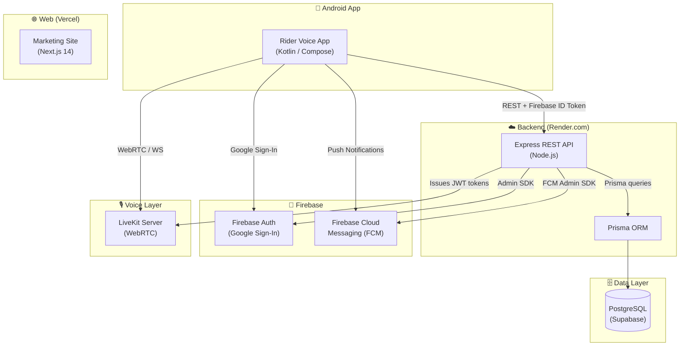
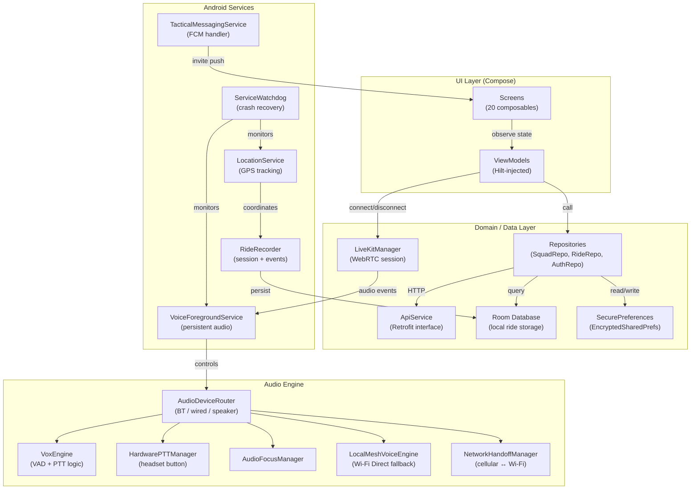
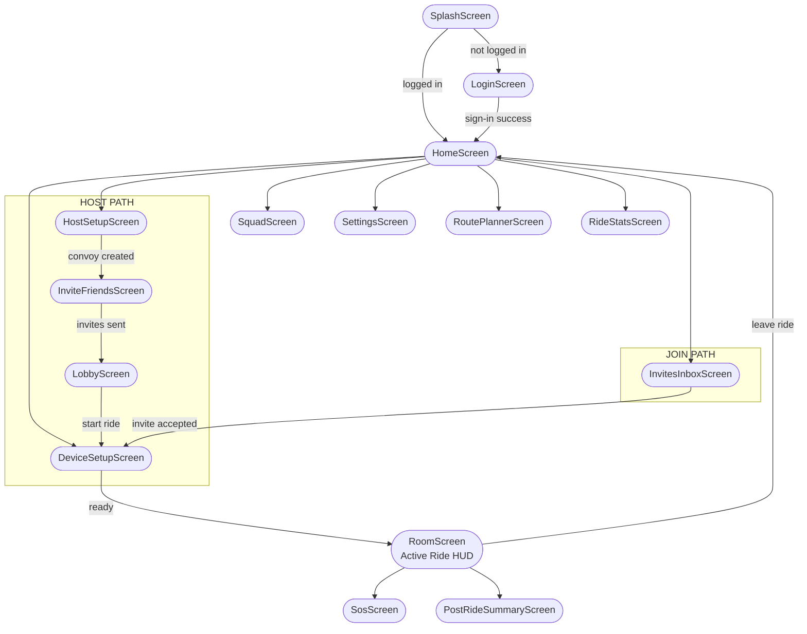
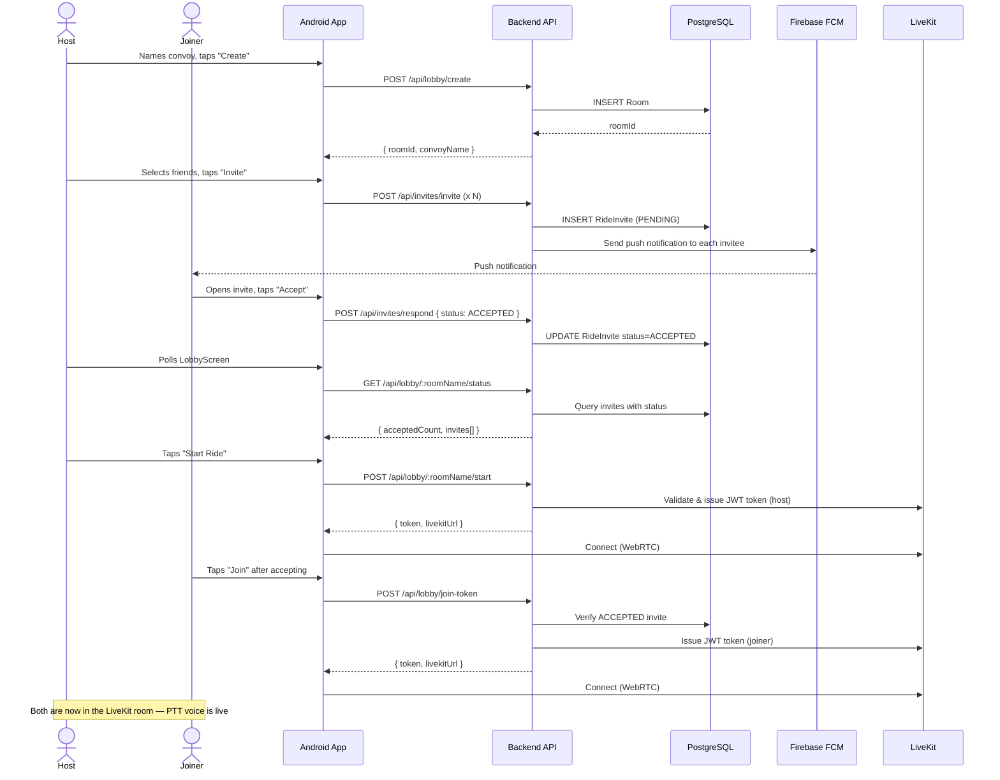
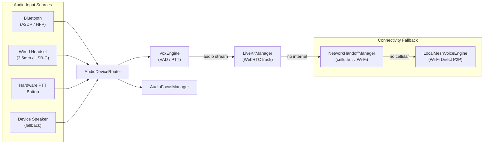
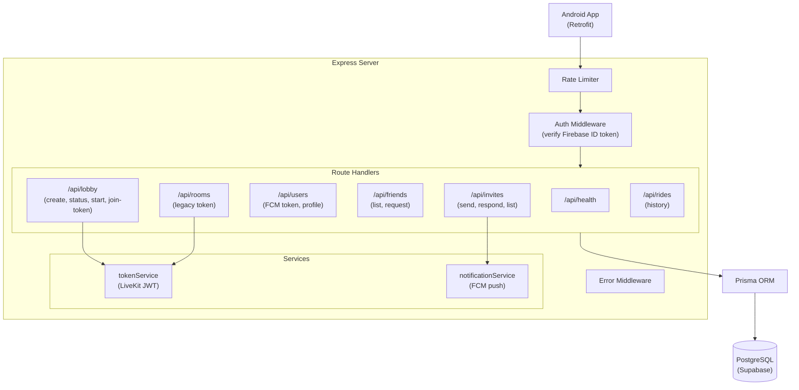
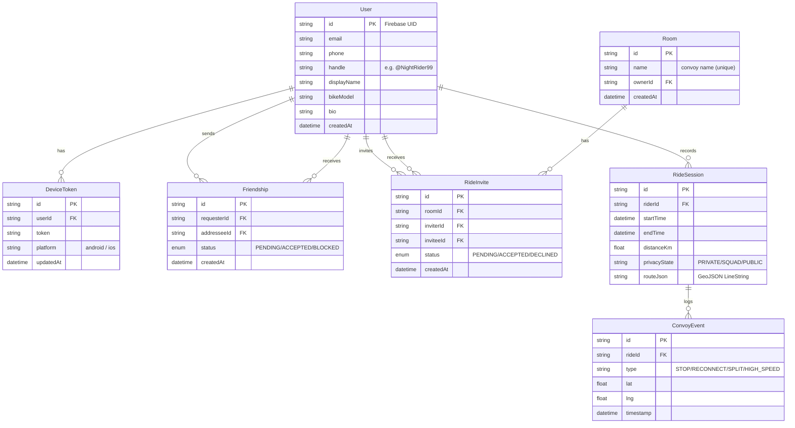

# Architecture – Rider Voice

This document describes the current technical architecture of the Rider Voice project. It covers the high-level system design, the internal structure of each major component, and the key data flows.

---

## 1. System Overview

---

## 2. Android App Architecture

The app follows **MVVM + Clean Architecture** with Hilt for dependency injection.

---

## 3. Navigation Flow

---

## 4. Convoy Creation & Join Flow (Sequence)

---

## 5. Audio Device Routing

---

## 6. Backend Structure

---

## 7. Data Model (Entity Relationship)

---

## 8. Key Design Decisions

| Decision | Rationale |
|----------|-----------|
| **LiveKit for voice** | WebRTC SFU purpose-built for low-latency group audio; provides client SDK for Android |
| **Firebase Auth as identity layer** | Handles Google OAuth and phone OTP; issues ID tokens the backend can verify with Admin SDK |
| **Prisma + PostgreSQL (Supabase)** | Type-safe ORM; Supabase gives managed Postgres with row-level security as a future option |
| **Token issued server-side only** | LiveKit tokens are never generated on-device; server validates invite status before issuing |
| **Lobby before LiveKit connect** | Separates the social invite flow from the audio session — saves LiveKit capacity and avoids orphaned sessions |
| **Room database for ride recording** | Rides are recorded locally first (works offline); can be synced to backend later |
| **Audio device abstraction** | `AudioDeviceRouter` decouples audio source selection from the PTT/VAD engine, making it easier to add new device types |
| **Foreground service for voice** | Keeps the audio session alive when the screen is off or the app is in the background |
| **Wi-Fi Direct fallback** | `LocalMeshVoiceEngine` allows local P2P audio if internet connectivity drops during a ride |
