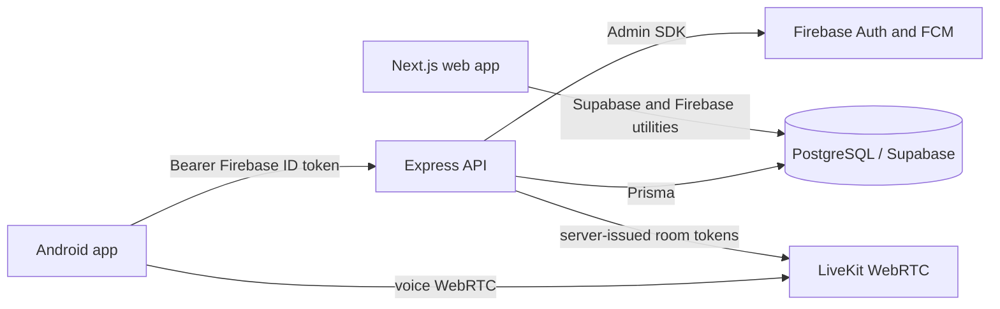
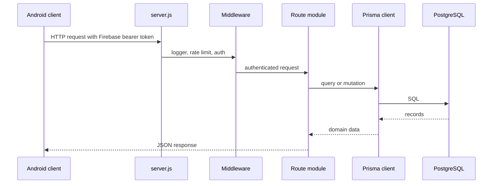
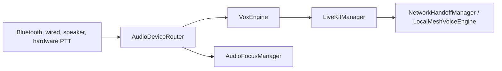

# RiderVoice Code Depth Structure

This document is the file-level map of the RiderVoice repository. It explains what each source area owns, where runtime behavior starts, and how the mobile app, API, database, LiveKit, and web application connect.

> Scope: source, configuration, deployment, database, and test files currently present in the repository. Generated folders such as `node_modules`, `.gradle`, `build`, and `.git` are intentionally omitted.

## 1. Repository Map

```text
Rider_APP/
├── .github/workflows/
│   ├── build.yml                         Android build and verification workflow
│   └── release.yml                       Versioned APK build, signing, checksum, release
├── .vscode/settings.json                 Workspace editor settings
├── ARCHITECTURE.md                       High-level diagrams and design decisions
├── CODE_DEPTH_STRUCTURE.md               This file-level code map
├── README.md                             Product overview and developer quick start
├── Rider_Voice_Complete_Documentation.docx
├── render.yaml                           Render deployment definition for the backend
├── backend/
│   ├── Dockerfile                        Backend container image definition
│   ├── .env.example                      Backend environment variable template
│   ├── package.json                      Node scripts and runtime dependencies
│   ├── package-lock.json                 Locked Node dependency graph
│   ├── supabase_schema.sql                SQL schema/reference for Supabase
│   ├── prisma/
│   │   ├── schema.prisma                 Source of truth for Prisma models
│   │   └── migrations/                   Versioned database changes
│   └── src/
│       ├── server.js                     Express application bootstrap
│       ├── db.js                         Shared Prisma client
│       ├── config/firebaseAdmin.js       Firebase Admin initialization
│       ├── middleware/                   Cross-cutting request processing
│       ├── routes/                       Authenticated and public API endpoints
│       └── services/                     External-service integrations
├── livekit-server/
│   ├── docker-compose.yml                Local LiveKit container
│   └── livekit.yaml                      LiveKit RTC, STUN, and development keys
├── mobile-app/
│   ├── build.gradle                      Root Android build configuration
│   ├── settings.gradle                   Gradle module and repository settings
│   ├── gradle.properties                 Gradle flags and JVM properties
│   ├── gradlew / gradlew.bat             Gradle wrapper entry points
│   └── app/                              Android application module
└── web-app/                              Next.js public site and admin console
```

## 2. Runtime Boundaries



### Runtime entry points

| Area           | Entry point                                                                | Responsibility                                                                                                   |
| -------------- | -------------------------------------------------------------------------- | ---------------------------------------------------------------------------------------------------------------- |
| Backend        | `backend/src/server.js`                                                    | Creates Express app, installs middleware/routes, starts the HTTP server, and runs database compatibility checks. |
| Android        | `mobile-app/app/src/main/java/com/ridervoice/App.kt` and `MainActivity.kt` | Initializes the application graph and launches the Compose UI.                                                   |
| LiveKit        | `livekit-server/docker-compose.yml`                                        | Starts the local LiveKit server using `livekit.yaml`.                                                            |
| Web            | `web-app/src/app/layout.tsx` and `page.tsx`                                | Defines the Next.js root layout and public landing page.                                                         |
| Web middleware | `web-app/middleware.ts`                                                    | Applies request-time web middleware, including Supabase session handling where configured.                       |

## 3. Backend Depth

### 3.1 Bootstrap and shared infrastructure

- `backend/src/server.js` creates the Express application, enables CORS and JSON parsing, installs request logging and rate limiting, mounts routes, and attaches the final error handler.
- `backend/src/db.js` exposes the shared Prisma client used by route handlers.
- `backend/src/config/firebaseAdmin.js` owns Firebase Admin SDK setup for token verification and push notifications.
- `backend/Dockerfile` packages the API for container deployment.
- `render.yaml` deploys the `backend` directory as a Node service on Render and supplies LiveKit secrets through the platform.

### 3.2 Middleware

| File                                        | Owns                                                                                         |
| ------------------------------------------- | -------------------------------------------------------------------------------------------- |
| `backend/src/middleware/authMiddleware.js`  | Verifies Firebase bearer tokens and attaches the authenticated user identity to the request. |
| `backend/src/middleware/errorMiddleware.js` | Converts thrown route errors into consistent HTTP error responses.                           |
| `backend/src/middleware/rateLimiter.js`     | Limits request frequency before protected route handlers run.                                |
| `backend/src/middleware/requestLogger.js`   | Records request activity for operational visibility.                                         |

### 3.3 Route surface

All routes below are mounted by `server.js`. Except for health checks, they are behind `authMiddleware`.

| File                 | Mount                         | Responsibility                                                                   |
| -------------------- | ----------------------------- | -------------------------------------------------------------------------------- |
| `healthRoute.js`     | `/api/health`, `/health`, `/` | Liveness and basic API availability response.                                    |
| `userRoutes.js`      | `/api/users`                  | Current user profile, handle search, and FCM device-token registration.          |
| `friendRoutes.js`    | `/api/friends`                | Squad/friend discovery and friendship state changes.                             |
| `inviteRoutes.js`    | `/api/invites`                | Sends, lists, and responds to ride invitations.                                  |
| `lobbyRoutes.js`     | `/api/lobby`                  | Creates rooms, reports lobby state, starts rides, and handles join/share tokens. |
| `roomRoutes.js`      | `/api/rooms`                  | Room operations and LiveKit room-token behavior retained by the room API.        |
| `rideRoutes.js`      | `/api/rides`                  | Ride-session history and recorded ride data.                                     |
| `emergencyRoutes.js` | `/api/emergency`              | SOS/emergency alert creation and recipient notification flow.                    |

### 3.4 Services

- `backend/src/services/notificationService.js` sends Firebase Cloud Messaging notifications without placing FCM details in route modules.
- LiveKit token creation is handled in the route layer using the LiveKit server SDK and server-only credentials. Clients never generate LiveKit JWTs.

### 3.5 Backend request path



## 4. Database Depth

`backend/prisma/schema.prisma` is the primary typed model definition. `backend/supabase_schema.sql` is the SQL-oriented schema/reference used with Supabase.

### Models and relationships

| Model            | Purpose                                                                  |
| ---------------- | ------------------------------------------------------------------------ |
| `User`           | Firebase identity plus rider profile, role, and relationships.           |
| `DeviceToken`    | FCM tokens associated with a rider and platform.                         |
| `Friendship`     | Directed friend request with pending, accepted, or blocked state.        |
| `Room`           | Named convoy owned by a rider.                                           |
| `RoomJoinToken`  | Expiring share/join token for a room.                                    |
| `RideInvite`     | Invitation from one rider to another for a room.                         |
| `RideSession`    | Recorded ride metadata, route, privacy state, and timing.                |
| `ConvoyEvent`    | Location-based ride event such as stop, reconnect, split, or high speed. |
| `EmergencyAlert` | SOS alert, coordinates, recipient list, status, and room relation.       |
| `admin_settings` | JSON-backed settings for the web admin area.                             |

### Migration history

- `20260906_add_emergency_alert/migration.sql` adds emergency-alert persistence.
- `20260906_add_room_name_to_ride_session/migration.sql` adds room context to recorded rides.
- `20260908_add_room_join_tokens_and_removed_status/migration.sql` adds expiring room tokens and the `REMOVED` invite state.

`server.js` also runs a compatibility check at startup for the `REMOVED` enum value and `RoomJoinToken` table. This is a deployment safeguard, not a replacement for committing Prisma migrations.

## 5. Android App Depth

The Android module follows a Compose UI plus MVVM/Clean Architecture style. UI screens observe ViewModels; ViewModels coordinate repositories and managers; infrastructure packages handle audio, networking, persistence, services, and recovery.

### 5.1 Application, navigation, and models

- `App.kt`: application-level initialization and dependency graph entry.
- `MainActivity.kt`: Android activity and Compose host.
- `models/Models.kt`: shared client-side data models.
- `navigation/Routes.kt`: route identifiers.
- `navigation/NavGraph.kt`: screen graph and navigation destinations.
- `navigation/NavigationProvider.kt`: navigation access/provider abstraction.
- `di/AppModule.kt`: Hilt bindings and construction of shared dependencies.
- `utils/Constants.kt`, `GeoUtils.kt`, `Logger.kt`, and `OEMBatteryWarning.kt`: cross-cutting constants, location helpers, logging, and device battery guidance.

### 5.2 UI layer

#### Screens

`ui/screens/` contains the user-facing flows: `SplashScreen`, `LoginScreen`, `RegisterScreen`, `HomeScreen`, `AccountScreen`, `HostSetupScreen`, `InviteFriendsScreen`, `InvitesInboxScreen`, `JoinRoomScreen`, `LobbyScreen`, `DeviceSetupScreen`, `HeadsetSettingsScreen`, `RoomScreen`, `SosScreen`, `EmergencyAlertActivity`, `RoutePlannerScreen`, `RideStatsScreen`, `RideReplayScreen`, `PostRideSummaryScreen`, and `SettingsScreen`.

#### ViewModels

`ui/viewmodels/` contains screen state and actions for account, authentication, device setup, home, host setup, invites, joining, lobby, post-ride summary, ride statistics, route planning, settings, SOS, squad, and update flows.

#### Reusable components and theme

- `ui/components/` contains tactical controls, participant cards, profile and rider dialogs, voice controls, debug overlay, update dialog, and the add-riders sheet.
- `ui/theme/Color.kt`, `Theme.kt`, and `Type.kt` define the Compose visual system.
- `res/layout/notification_tactical_collapsed.xml` and `notification_tactical_expanded.xml` define foreground-service notification layouts.
- `res/xml/file_paths.xml` defines `FileProvider` paths used by OTA installation.
- `res/values/strings.xml` and `font_certs.xml` hold Android resources and certificate configuration.

### 5.3 Data, security, and persistence

- `data/local/entities/Entities.kt`: Room entities.
- `data/local/RideDatabase.kt`: Room database and DAOs.
- `data/repository/SquadRepository.kt`: squad/friend data access.
- `security/AuthRepository.kt`: authentication and Firebase identity operations.
- `security/SecurePreferences.kt`: encrypted local preferences for sensitive state.
- `network/ApiService.kt`: Retrofit endpoint contract for the backend.
- `network/LiveKitManager.kt`: LiveKit connection and room/session integration.

### 5.4 Audio and voice path



- `audio/AudioDeviceRouter.kt`: chooses and switches audio devices.
- `audio/AudioFocusManager.kt`: coordinates Android audio focus.
- `audio/HardwarePTTManager.kt`: handles physical push-to-talk controls.
- `audio/VoxEngine.kt`: voice activation/PTT decision logic.
- `audio/NetworkHandoffManager.kt`: handles connectivity transitions.
- `audio/LocalMeshVoiceEngine.kt` and `WifiDirectManager.kt`: local fallback transport support.

### 5.5 Connectivity, services, and recovery

- `network/ConnectionState.kt`, `NetworkObserver.kt`, `NetworkResilienceManager.kt`, and `ReconnectManager.kt` model connectivity and reconnect behavior.
- `services/VoiceForegroundService.kt` keeps voice active in the background.
- `services/LocationService.kt` collects ride location.
- `services/RideRecorder.kt` records sessions and convoy events.
- `services/TacticalMessagingService.kt` receives tactical/FCM messages.
- `services/ServiceWatchdog.kt` and `ThermalManager.kt` monitor long-running service health and device heat.
- `participants/ParticipantManager.kt` tracks active LiveKit participants.
- `monitoring/ConnectionQualityMonitor.kt` observes connection quality.
- `sync/RoomStateSynchronizer.kt` reconciles room state.
- `recovery/CrashRecoveryManager.kt` and `SessionRestore.kt` restore service/session state after failure.
- `permissions/PermissionManager.kt` and `PermissionsHelper.kt` centralize runtime permission handling.
- `errors/ErrorHandler.kt` provides shared error presentation/translation.

### 5.6 OTA update flow

- `update/AppVersion.kt`: parses and compares semantic versions.
- `update/UpdateModels.kt`: update metadata models.
- `update/UpdateManager.kt`: checks, streams, hashes, and hands validated APKs to the installer.
- `ui/viewmodels/UpdateViewModel.kt` and `ui/components/UpdateDialog.kt`: expose update state to the UI.
- `mobile-app/app/src/test/java/com/ridervoice/update/AppVersionTest.kt`: version comparison tests.

## 6. Web App Depth

`web-app` is a Next.js application containing a public RiderVoice site, waitlist endpoint, and authenticated admin console.

### Public application

- `src/app/layout.tsx`: root metadata/layout.
- `src/app/page.tsx`: public home page composition.
- `src/app/globals.css`: global styles.
- `src/app/privacy/page.tsx` and `src/app/terms/page.tsx`: policy pages.
- `src/components/`: page sections for hero, features, compatibility, map preview, workflow, roadmap, trust content, FAQ, footer, and waitlist form. Each visual component has a paired CSS module where present.

### Admin application

- `src/app/admin/(auth)/login/page.tsx`: admin login screen.
- `src/app/admin/(auth)/layout.tsx`: auth-area layout.
- `src/app/admin/(app)/layout.tsx`: authenticated admin shell.
- `src/app/admin/(app)/page.tsx`: admin dashboard.
- `src/app/admin/(app)/users`, `rooms`, `invites`, `rides`, `reports`, `roles`, and `settings`: operational admin views.
- `UsersTable.tsx` and `settings/SettingsForm.tsx`: interactive admin controls.
- `src/app/admin/admin.css`: admin-specific styling.

### Web API and utilities

- `src/app/api/waitlist/route.ts`: waitlist submission endpoint.
- `src/app/api/admin/logout/route.ts` and `session/route.ts`: admin session operations.
- `src/app/api/admin/settings/get/route.ts` and `settings/route.ts`: admin settings read/write endpoints.
- `src/app/api/admin/users/role/route.ts`: admin role management endpoint.
- `src/lib/auth/requireAdmin.ts`: server-side admin authorization guard.
- `src/utils/firebase/admin.ts` and `client.ts`: Firebase server/client setup.
- `src/utils/supabase/admin.ts`: server-side Supabase access.
- `utils/supabase/client.ts`, `middleware.ts`, and `server.ts`: Supabase browser, middleware, and server helpers.
- `middleware.ts`: Next.js request middleware entry.
- `next.config.ts`, `tsconfig.json`, `eslint.config.mjs`, and `postcss.config.mjs`: framework, TypeScript, lint, and CSS tooling configuration.

## 7. LiveKit Depth

- `livekit-server/docker-compose.yml` exposes the local LiveKit HTTP/WebSocket port and UDP RTC port.
- `livekit-server/livekit.yaml` configures RTC, external IP behavior, Google STUN, and development API keys.
- Production credentials are expected through backend environment variables such as `LIVEKIT_URL`, `LIVEKIT_API_KEY`, and `LIVEKIT_API_SECRET`; development values in the local config must not be reused in production.

## 8. Main User Flows

### Host and join flow

1. Android authenticates with Firebase.
2. Android sends the Firebase ID token to an authenticated backend route.
3. A host creates a room through `/api/lobby` and invites riders through `/api/invites`.
4. The backend persists room/invite state with Prisma and sends FCM notifications when needed.
5. The backend validates room and invitation state before issuing a LiveKit token.
6. Android connects to LiveKit and starts its foreground voice/audio path.
7. Ride recording and emergency alerts use backend persistence alongside local Android state.

### SOS flow

`SosScreen`/`SosViewModel` collects the rider action and coordinates, `emergencyRoutes.js` validates and persists an `EmergencyAlert`, and the notification service distributes the alert to registered recipients.

### OTA flow

`SettingsScreen` opens the update UI, `UpdateViewModel` requests update state, `UpdateManager` downloads to app-private storage, verifies version and SHA-256, and launches the Android package installer through the configured `FileProvider` paths.

## 9. Build and Verification Commands

### Backend

```powershell
cd backend
npm install
npx prisma generate
npm start
```

### Android

```powershell
cd mobile-app
.\gradlew clean assembleDebug
.\gradlew test
```

### Web

```powershell
cd web-app
npm install
npm run lint
npm run build
```

### Local LiveKit

```powershell
cd livekit-server
docker compose up
```

## 10. Maintenance Rules

- Update this document when a top-level module, runtime entry point, route family, database model, or cross-module flow changes.
- Keep `ARCHITECTURE.md` focused on system diagrams and design decisions; keep this document focused on file ownership and code navigation.
- Treat Prisma migrations as append-only history. Do not edit an applied migration to change production schema history.
- Keep Firebase and LiveKit secrets in environment/configuration management, never in committed source.
- When adding a new Android screen, add its route, ViewModel, navigation entry, and tests where behavior is non-trivial.
