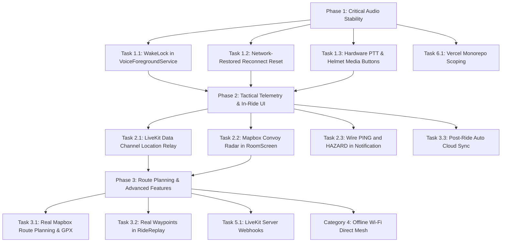

# Rider Voice — Master System Roadmap & Task Implementation Blueprint

This document provides a comprehensive, component-by-component audit of everything currently missing, incomplete, or stubbed out across the **Rider Voice** platform (**Android Mobile App**, **Backend API**, and **Web Dashboard**).

For each missing item, this blueprint documents:
1. **What is missing / stubbed**
2. **Why it matters (Rider UX & Technical Rationale)**
3. **Where in the code (Files, Classes, Methods, Line Ranges)**
4. **How it will work (Architecture & Data Flow)**
5. **How to add it (Step-by-Step Implementation & Code)**
6. **Priority, Dependencies & Validation Criteria**

---

## Master Architecture & Gap Matrix

| ID | Domain | Component / Feature | Current State | Priority | Target Milestone |
|---|---|---|---|---|---|
| **A-1** | Audio / Service | Background `WakeLock` in `VoiceForegroundService` | Declared but never acquired (causes CPU sleep kills) | **P0 (Critical)** | v0.0.3.2 |
| **A-2** | VoIP / Network | Auto-Reset Reconnect Backoff on Network Restored | Stops reconnecting forever after 10 attempts | **P0 (Critical)** | v0.0.3.2 |
| **A-3** | Audio / Hardware | Hardware Handlebar / Helmet PTT Media Button | Unwired class with obsolete audio focus call | **P1 (High)** | v0.0.3.2 |
| **A-4** | Audio / Settings | Connect `HeadsetSettingsScreen` to Pipeline | Writes to unread, unencrypted SharedPreferences | **P1 (High)** | v0.0.3.2 |
| **A-5** | Audio / UI | Audio Route Picker Dialog in `RoomScreen` | Dialog options are empty no-ops | **P1 (High)** | v0.0.3.2 |
| **A-6** | Audio / VOX | Live Reactivity to Settings in Active Call | Settings only read once at ride launch | **P2 (Medium)** | v0.0.4.0 |
| **A-7** | Audio / WebRTC | Single WebRTC Capture Sink vs Dual `AudioRecord` | Runs two concurrent `AudioRecord` hardware captures | **P2 (Research)** | v0.0.4.0 |
| **T-1** | Convoy / Telemetry | LiveKit Data Channel Peer Location & Hazard Relay | LiveKit data packets enabled on backend, unused in app | **P1 (High)** | v0.0.3.3 |
| **T-2** | Convoy / UI | In-Ride Mapbox Convoy Radar in `RoomScreen` | Shows static text with external Google Maps launch | **P1 (High)** | v0.0.3.3 |
| **T-3** | Service / Notification | Tactical Notification "PING" and "HAZARD" Stubs | Empty `when` branches in foreground service | **P1 (High)** | v0.0.3.3 |
| **T-4** | Convoy / Core | Replace Dummy Stubs (`RoomStateSynchronizer`, etc.) | 9-line non-networked in-memory maps | **P2 (Medium)** | v0.0.4.0 |
| **R-1** | Navigation | Real GPS & Mapbox Routing in `RoutePlannerViewModel` | Hardcoded mock riders and static 123 km route | **P2 (Medium)** | v0.0.4.0 |
| **R-2** | Telemetry | Real Waypoint Loading in `RideReplayScreen` | Generates fake sine-wave path when opened | **P2 (Medium)** | v0.0.3.3 |
| **R-3** | Cloud Sync | Automatic Cloud Sync in `PostRideSummaryViewModel` | `save()` only clears local state without uploading | **P1 (High)** | v0.0.3.3 |
| **R-4** | Telemetry | Dynamic Speed & Elevation Charts in `RideStats` | Uses static mock list or empty list | **P2 (Medium)** | v0.0.4.0 |
| **M-1** | Offline Mesh | Complete Signaling in `WifiDirectManager` | Socket loop stops at `readUTF()` without parsing SDP | **P3 (Experimental)** | v0.1.0.0 |
| **M-2** | Offline Mesh | Wire `NetworkHandoffManager` to `LiveKitManager` | Unreferenced class using wrong engine parameter | **P3 (Experimental)** | v0.1.0.0 |
| **B-1** | Backend / LiveKit | LiveKit Webhook Handler for Room & Member Events | No webhook listener; DB doesn't know when room ends | **P1 (High)** | v0.0.3.3 |
| **B-2** | Backend / Infra | Distributed Redis Rate Limiter & Token Caching | In-memory `Map` resets on server restart | **P2 (Medium)** | v0.0.4.0 |
| **W-1** | Web / DevOps | Vercel Monorepo Ignored Build Step | Mobile/backend commits trigger broken web deploys | **P0 (Immediate)** | v0.0.3.2 |
| **W-2** | Web / Spectator | Live Convoy Radar & Telemetry on Web Dashboard | Static CSS mockup with dummy SVG route | **P3 (Feature)** | v0.1.0.0 |
| **P-1** | Power / VOX | Suspend `VoxEngine` Capture in PTT Mode & Mute State | Continuous 50 Hz DSP calculations drain battery when muted | **P1 (High)** | v0.0.3.3 |
| **P-2** | Power / GPS | Stationary GPS Sleep & Activity Recognition (`STILL` mode) | Polls 2-5s GPS indefinitely while parked at rest stops | **P1 (High)** | v0.0.3.3 |
| **P-3** | Power / Network | Opus WebRTC Discontinuous Transmission (DTX) | Sends 50 packets/sec during silence; keeps radio in high-power state | **P1 (High)** | v0.0.3.3 |
| **P-4** | Power / UI | Eliminate 50 Hz Compose State Flooding (`currentAmplitude`) | Triggers 50 Hz recomposition checks for unused UI states | **P1 (High)** | v0.0.3.2 |
| **P-5** | Power / Display | AMOLED True-Black Profile & Proximity Pocket Mode | Full screen draws power when phone is inside pocket/tank bag | **P2 (Medium)** | v0.0.4.0 |
| **P-6** | Power / Thermal | Thermal Degradation Multi-Tier Throttling Engine | Hot phone on handlebar mount needs automated step-down | **P1 (High)** | v0.0.3.3 |
| **V-1** | Audio / Latency | Pre-Roll Lookback Ring Buffer (Eliminate First-Word Loss) | 200-300ms attack + WebRTC unmute delay clips first spoken words | **P0 (Critical)** | v0.0.3.2 |
| **V-2** | Audio / Filter | Transmit-Side 300 Hz High-Pass Filter (Strip Wind Rumble) | HPF only applied to detector RMS; raw wind transmits to Opus | **P0 (Critical)** | v0.0.3.2 |
| **V-3** | Audio / VOX | Spectral Flux & Zero-Crossing Wind Discriminator | High-speed wind gusts trigger false VOX gate openings | **P1 (High)** | v0.0.3.3 |
| **V-4** | Audio / AI-DSP | Lightweight RNNoise / DeepFilterNet Neural Suppressor | WebRTC default NS cannot suppress turbulent non-stationary wind | **P1 (High)** | v0.0.4.0 |
| **V-5** | Audio / VOX | Speed-Adaptive Dynamic Hold Time | 900ms hold leaks trailing wind roar after speech ends | **P1 (High)** | v0.0.3.3 |
| **D-1** | Audio / Preamp | Device-Adaptive Digital Preamp (+6 dB to +18 dB for Jack/USB) | Low-output passive electret mics require shouting to open VOX | **P0 (Critical)** | v0.0.3.2 |
| **D-2** | Audio / AGC | Enable WebRTC AGC on Wired 3.5mm Headset & USB Audio | AGC is disabled on unamplified wired mics, causing faint audio | **P0 (Critical)** | v0.0.3.2 |
| **D-3** | Audio / VOX | Device-Aware Sensitivity & Open Ratio (Jack/USB vs Bluetooth) | 3.0x open ratio forces mic right against lips on wired inputs | **P0 (Critical)** | v0.0.3.2 |
| **D-4** | Audio / VOX | Soft-Knee Speech Hangover to Stop Trailing Syllable Loss | Rigid close ratio (1.8x) drops quiet consonants at word ends | **P1 (High)** | v0.0.3.3 |
| **D-5** | Audio / UI | Calibrate Segmented VU Meter (-20 dB to +3 dB) to Real dBFS | VU meter barely moves on quiet inputs; doesn't reflect actual dB | **P2 (Medium)** | v0.0.3.3 |

---

## Category 1: Audio, VoIP & Hardware Controls

### Task 1.1: Background `WakeLock` in `VoiceForegroundService`
- **Current State**: In [`VoiceForegroundService.kt`](file:///c:/Users/umerz/OneDrive/Desktop/Rider_APP-main/Rider_APP-main/mobile-app/app/src/main/java/com/ridervoice/services/VoiceForegroundService.kt), `wakeLock` is declared as a nullable field (`private var wakeLock: PowerManager.WakeLock? = null`) and cleaned up in `onDestroy()`, but **it is never initialized or acquired** in `onCreate()`.
- **Why It Matters**: When a rider mounts their phone in a tank bag or puts it into a leather jacket pocket, Android turns the screen off. Within 30–60 seconds, the OS initiates Doze mode and throttles CPU execution. While the foreground service keeps the process alive, the high-speed polling in [`VoxEngine.kt`](file:///c:/Users/umerz/OneDrive/Desktop/Rider_APP-main/Rider_APP-main/mobile-app/app/src/main/java/com/ridervoice/audio/VoxEngine.kt) (every 20 ms) and WebRTC audio threads suffer high jitter, stutter, or complete audio loss.
- **Where**:
  - File: [`VoiceForegroundService.kt`](file:///c:/Users/umerz/OneDrive/Desktop/Rider_APP-main/Rider_APP-main/mobile-app/app/src/main/java/com/ridervoice/services/VoiceForegroundService.kt#L47-L65)
  - Method: `onCreate()`
- **How It Works**:
  1. Acquire a `PowerManager.PARTIAL_WAKE_LOCK`.
  2. Set `setReferenceCounted(false)` to prevent crash on unexpected release calls.
  3. Acquire with a 10-hour safety limit (a typical full motorcycle day ride).
- **How to Implement**:
  ```kotlin
  // Inside VoiceForegroundService.kt -> onCreate()
  val powerManager = getSystemService(Context.POWER_SERVICE) as PowerManager
  wakeLock = powerManager.newWakeLock(
      PowerManager.PARTIAL_WAKE_LOCK,
      "RiderVoice:VoiceAudioLock"
  ).apply {
      setReferenceCounted(false)
      acquire(10 * 3600 * 1000L) // 10-hour safety ceiling
  }
  ```

---

### Task 1.2: Network-Restored Reconnect Reset in `LiveKitManager`
- **Current State**: In [`LiveKitManager.kt`](file:///c:/Users/umerz/OneDrive/Desktop/Rider_APP-main/Rider_APP-main/mobile-app/app/src/main/java/com/ridervoice/network/LiveKitManager.kt), reconnection backoff increments up to `MAX_RECONNECT_ATTEMPTS = 10`. If a ride goes through a tunnel or mountain valley without cell reception for more than 4 minutes, all 10 retries fail, transitioning to `ConnectionState.FAILED`. When cellular signal returns, the app remains permanently dead until the rider pulls over, takes off gloves, and taps Leave/Rejoin.
- **Why It Matters**: Motorcycle routes regularly pass through cellular blackouts. Reconnection must happen automatically without touching the screen.
- **Where**:
  - Files:
    - [`LiveKitManager.kt`](file:///c:/Users/umerz/OneDrive/Desktop/Rider_APP-main/Rider_APP-main/mobile-app/app/src/main/java/com/ridervoice/network/LiveKitManager.kt)
    - [`NetworkResilienceManager.kt`](file:///c:/Users/umerz/OneDrive/Desktop/Rider_APP-main/Rider_APP-main/mobile-app/app/src/main/java/com/ridervoice/network/NetworkResilienceManager.kt)
- **How It Works**:
  1. [`NetworkResilienceManager.kt`](file:///c:/Users/umerz/OneDrive/Desktop/Rider_APP-main/Rider_APP-main/mobile-app/app/src/main/java/com/ridervoice/network/NetworkResilienceManager.kt) monitors `ConnectivityManager.NetworkCallback`.
  2. When network transitions back to `NetworkHealth.CONNECTED`, notify `LiveKitManager.onNetworkRestored()`.
  3. If currently in `FAILED` or `RECONNECTING`, reset `reconnectAttempts = 0` and trigger immediate reconnect using cached credentials (`lastUrl`, `lastToken`).
- **How to Implement**:
  ```kotlin
  // In LiveKitManager.kt:
  fun onNetworkRestored() {
      if (_connectionState.value == ConnectionState.FAILED && lastUrl.isNotBlank() && lastToken.isNotBlank()) {
          Log.i(TAG, "Network restored — resetting retry counter and auto-reconnecting")
          reconnectAttempts = 0
          scope.launch { connectInternal(lastUrl, lastToken) }
      }
  }

  // In RoomViewModel.kt init:
  viewModelScope.launch {
      networkResilienceManager.networkHealth.collect { health ->
          if (health == NetworkHealth.CONNECTED) {
              liveKitManager.onNetworkRestored()
          }
      }
  }
  ```

---

### Task 1.3: Wire `HardwarePTTManager` for Handlebar & Helmet Remotes
- **Current State**: [`HardwarePTTManager.kt`](file:///c:/Users/umerz/OneDrive/Desktop/Rider_APP-main/Rider_APP-main/mobile-app/app/src/main/java/com/ridervoice/audio/HardwarePTTManager.kt) implements media button event listening via `MediaSessionCompat`, but:
  1. It is never instantiated or invoked in [`RoomViewModel.kt`](file:///c:/Users/umerz/OneDrive/Desktop/Rider_APP-main/Rider_APP-main/mobile-app/app/src/main/java/com/ridervoice/state/RoomViewModel.kt).
  2. It has an outdated direct call to `audioManager.requestAudioFocus()`, violating the Single Audio Owner rule (only [`AudioDeviceRouter.kt`](file:///c:/Users/umerz/OneDrive/Desktop/Rider_APP-main/Rider_APP-main/mobile-app/app/src/main/java/com/ridervoice/audio/AudioDeviceRouter.kt) may manage audio focus).
- **Why It Matters**: Riders cannot operate touchscreen buttons while wearing riding gloves at 100 km/h. Helmet systems (Sena Jog Dial, Cardo Roller, FreedConn) and Bluetooth handlebar remotes send AVRCP `KEYCODE_HEADSETHOOK` and `KEYCODE_MEDIA_PLAY_PAUSE` commands.
- **Where**:
  - Files:
    - [`HardwarePTTManager.kt`](file:///c:/Users/umerz/OneDrive/Desktop/Rider_APP-main/Rider_APP-main/mobile-app/app/src/main/java/com/ridervoice/audio/HardwarePTTManager.kt)
    - [`RoomViewModel.kt`](file:///c:/Users/umerz/OneDrive/Desktop/Rider_APP-main/Rider_APP-main/mobile-app/app/src/main/java/com/ridervoice/state/RoomViewModel.kt)
- **How to Implement**:
  1. Remove `audioManager.requestAudioFocus(...)` from `HardwarePTTManager.kt`.
  2. Inject `HardwarePTTManager` into `RoomViewModel`.
  3. In `RoomViewModel.joinRoom()`:
     ```kotlin
     hardwarePTTManager.onMicToggleRequest = { open ->
         liveKitManager.onPttPressed(open)
     }
     hardwarePTTManager.activateSession()
     ```
  4. In `RoomViewModel.cleanup()`:
     ```kotlin
     hardwarePTTManager.deactivateSession()
     ```

---

### Task 1.4: Connect `HeadsetSettingsScreen` to `SecurePreferences` & Pipeline
- **Current State**: [`HeadsetSettingsScreen.kt`](file:///c:/Users/umerz/OneDrive/Desktop/Rider_APP-main/Rider_APP-main/mobile-app/app/src/main/java/com/ridervoice/ui/screens/HeadsetSettingsScreen.kt) writes configuration options (`enableHardwarePtt`, `hybridVoxMode`, `strictDebounce`, `enhancedCompatibility`) to an unencrypted, detached `context.getSharedPreferences("headset_prefs", Context.MODE_PRIVATE)`. Nothing else in the app reads these preferences.
- **Why It Matters**: Users configuring their headset controls assume their choices take effect. Currently, changing these toggles has zero effect on the audio routing or PTT engine.
- **Where**:
  - Screen: [`HeadsetSettingsScreen.kt`](file:///c:/Users/umerz/OneDrive/Desktop/Rider_APP-main/Rider_APP-main/mobile-app/app/src/main/java/com/ridervoice/ui/screens/HeadsetSettingsScreen.kt)
  - Preferences: [`SecurePreferences.kt`](file:///c:/Users/umerz/OneDrive/Desktop/Rider_APP-main/Rider_APP-main/mobile-app/app/src/main/java/com/ridervoice/security/SecurePreferences.kt)
  - Consumers: [`HardwarePTTManager.kt`](file:///c:/Users/umerz/OneDrive/Desktop/Rider_APP-main/Rider_APP-main/mobile-app/app/src/main/java/com/ridervoice/audio/HardwarePTTManager.kt), [`AudioDeviceRouter.kt`](file:///c:/Users/umerz/OneDrive/Desktop/Rider_APP-main/Rider_APP-main/mobile-app/app/src/main/java/com/ridervoice/audio/AudioDeviceRouter.kt)
- **How to Implement**:
  1. Add getters and setters for `isHardwarePttEnabled()`, `isHybridVoxEnabled()`, and `isScoDebounceStrict()` inside `SecurePreferences.kt`.
  2. Inject `SecurePreferences` into `HeadsetSettingsScreen.kt` (or create `HeadsetSettingsViewModel`).
  3. In `HardwarePTTManager.kt`, check `securePreferences.isHardwarePttEnabled()` before handling media button key events.

---

### Task 1.5: Fix Audio Route Picker Dialog in `RoomScreen`
- **Current State**: In [`RoomScreen.kt`](file:///c:/Users/umerz/OneDrive/Desktop/Rider_APP-main/Rider_APP-main/mobile-app/app/src/main/java/com/ridervoice/ui/screens/RoomScreen.kt#L282-L330), tapping the audio device badge opens an "AUDIO OUTPUT ROUTE" modal listing:
  - "Helmet Headset (Bluetooth SCO)"
  - "Phone Speakerphone"
  - "Phone Earpiece / Wired"
  Each `clickable` handler only executes `{ showAudioRoutePicker = false }` without triggering device selection.
- **Why It Matters**: Riders cannot switch between helmet Bluetooth intercom and phone speaker if routing needs manual override.
- **Where**:
  - UI: [`RoomScreen.kt`](file:///c:/Users/umerz/OneDrive/Desktop/Rider_APP-main/Rider_APP-main/mobile-app/app/src/main/java/com/ridervoice/ui/screens/RoomScreen.kt#L282-L330)
  - ViewModel: [`RoomViewModel.kt`](file:///c:/Users/umerz/OneDrive/Desktop/Rider_APP-main/Rider_APP-main/mobile-app/app/src/main/java/com/ridervoice/state/RoomViewModel.kt)
  - Router: [`AudioDeviceRouter.kt`](file:///c:/Users/umerz/OneDrive/Desktop/Rider_APP-main/Rider_APP-main/mobile-app/app/src/main/java/com/ridervoice/audio/AudioDeviceRouter.kt)
- **How to Implement**:
  1. Add `setAudioRoute(deviceType: Int)` to `RoomViewModel`.
  2. Wire `setAudioRoute` to [`AudioDeviceRouter.kt`](file:///c:/Users/umerz/OneDrive/Desktop/Rider_APP-main/Rider_APP-main/mobile-app/app/src/main/java/com/ridervoice/audio/AudioDeviceRouter.kt) communication device API (`AudioDeviceInfo.TYPE_BLUETOOTH_SCO`, `TYPE_BUILTIN_SPEAKER`, `TYPE_BUILTIN_EARPIECE`).
  3. Call `viewModel.setAudioRoute(...)` inside the dialog option clicks before closing the modal.

---

### Task 1.6: Single WebRTC Capture Sink vs Dual `AudioRecord` (Step 9a Research)
- **Current Architecture**:
  1. [`VoxEngine.kt`](file:///c:/Users/umerz/OneDrive/Desktop/Rider_APP-main/Rider_APP-main/mobile-app/app/src/main/java/com/ridervoice/audio/VoxEngine.kt): Dedicated `AudioRecord` at 16 kHz `VOICE_COMMUNICATION` calculating RMS and noise floor.
  2. LiveKit SDK WebRTC: Second internal `AudioRecord` capturing audio for Opus encoding and SFU transmission.
- **Problem**: Running two concurrent hardware capture instances increases CPU usage and can cause audio contention on budget Android chipsets or Bluetooth SCO profiles.
- **Feasibility Verification**:
  - Does LiveKit's `LocalAudioTrack` or WebRTC audio sink receive audio frames when `setMicrophoneEnabled(false)` (muted)?
  - **Result**: In WebRTC, muting a `LocalAudioTrack` stops audio frame delivery to the sink or replaces frames with digital silence (zeros).
  - **Architectural Conclusion**: Because VOX needs to detect voice *while muted* in order to decide when to unmute, a separate capture thread or raw hardware hook *must* be maintained during VOX mode, OR WebRTC capture must remain active while the track is muted via Opus packet suppression. Keep the existing isolated `VoxEngine.audioRecord` capture with try/catch fallback (as completed in Step 5/6) as the safest production architecture.

---

## Category 2: Real-Time Convoy Data, Mapping & Tactical HUD

### Task 2.1: LiveKit Data Channel Peer Location & Hazard Relay
- **Current State**: The backend generates LiveKit access tokens with `canPublishData: true` enabled in [`roomRoutes.js`](file:///c:/Users/umerz/OneDrive/Desktop/Rider_APP-main/Rider_APP-main/backend/src/routes/roomRoutes.js#L54). However, [`LiveKitManager.kt`](file:///c:/Users/umerz/OneDrive/Desktop/Rider_APP-main/Rider_APP-main/mobile-app/app/src/main/java/com/ridervoice/network/LiveKitManager.kt) only handles audio tracks and never calls `room.localParticipant.publishData()`.
- **Why It Matters**: Convoys need to see rider locations on a radar screen, receive PTT transmission indicators, and broadcast instant road hazard warnings (potholes, debris, police, emergency stops) with ultra-low WebRTC latency (< 50 ms) without taxing backend REST databases.
- **Where**:
  - Mobile App:
    - [`LiveKitManager.kt`](file:///c:/Users/umerz/OneDrive/Desktop/Rider_APP-main/Rider_APP-main/mobile-app/app/src/main/java/com/ridervoice/network/LiveKitManager.kt)
    - [`RoomViewModel.kt`](file:///c:/Users/umerz/OneDrive/Desktop/Rider_APP-main/Rider_APP-main/mobile-app/app/src/main/java/com/ridervoice/state/RoomViewModel.kt)
    - [`LocationService.kt`](file:///c:/Users/umerz/OneDrive/Desktop/Rider_APP-main/Rider_APP-main/mobile-app/app/src/main/java/com/ridervoice/services/LocationService.kt)
- **Data Packet Schema (JSON / Protobuf)**:
  ```json
  {
    "type": "LOCATION_UPDATE",
    "uid": "user_123",
    "lat": 18.742,
    "lng": 73.401,
    "speed": 22.5,
    "heading": 142.0,
    "timestamp": 1727980000000
  }
  ```
  ```json
  {
    "type": "TACTICAL_HAZARD",
    "senderUid": "user_123",
    "hazardType": "POTHOLE", // "DEBRIS" | "POLICE" | "STOPPED_VEHICLE"
    "lat": 18.745,
    "lng": 73.403
  }
  ```
- **How to Implement**:
  1. In `LiveKitManager.kt`, register a data listener:
     ```kotlin
     room.events.collect { event ->
         when (event) {
             is RoomEvent.DataReceived -> {
                 val payload = event.data.decodeToString()
                 handleIncomingDataPacket(payload, event.participant?.identity)
             }
         }
     }
     ```
  2. Expose `publishDataMessage(payload: String)` using `room.localParticipant.publishData(payload.toByteArray(), DataTopic.RELIABLE)`.
  3. In `RoomViewModel.kt`, collect `locationService.currentLocation` and broadcast location updates every 3–5 seconds to all connected convoy members over the data channel.

---

### Task 2.2: In-Ride Mapbox Convoy Radar in `RoomScreen`
- **Current State**: [`RoomScreen.kt`](file:///c:/Users/umerz/OneDrive/Desktop/Rider_APP-main/Rider_APP-main/mobile-app/app/src/main/java/com/ridervoice/ui/screens/RoomScreen.kt#L343-L365) displays a placeholder icon (`Icons.Default.Navigation`) and a button that launches external Google Maps with an empty query `google.navigation:q=`.
- **Why It Matters**: The core value proposition of Rider Voice is knowing where your group is in real time without leaving the voice channel.
- **Where**:
  - Screen: [`RoomScreen.kt`](file:///c:/Users/umerz/OneDrive/Desktop/Rider_APP-main/Rider_APP-main/mobile-app/app/src/main/java/com/ridervoice/ui/screens/RoomScreen.kt)
  - ViewModel: [`RoomViewModel.kt`](file:///c:/Users/umerz/OneDrive/Desktop/Rider_APP-main/Rider_APP-main/mobile-app/app/src/main/java/com/ridervoice/state/RoomViewModel.kt)
- **How to Implement**:
  1. Embed Mapbox Compose `MapboxMap` into `RoomScreen.kt` (using the same pattern already implemented in [`RoutePlannerScreen.kt`](file:///c:/Users/umerz/OneDrive/Desktop/Rider_APP-main/Rider_APP-main/mobile-app/app/src/main/java/com/ridervoice/ui/screens/RoutePlannerScreen.kt#L221)).
  2. Render the user's current GPS location with an orientation heading cone.
  3. Render remote participant markers received from `remoteLocations` (received via Task 2.1 LiveKit Data Channel).
  4. Highlight the active speaker marker with an animated cyan pulse ring.

---

### Task 2.3: Wire "PING" and "HAZARD" in Tactical Notification
- **Current State**: In [`VoiceForegroundService.kt`](file:///c:/Users/umerz/OneDrive/Desktop/Rider_APP-main/Rider_APP-main/mobile-app/app/src/main/java/com/ridervoice/services/VoiceForegroundService.kt#L98-L103), the `onStartCommand()` branches for `ACTION_PING` and `ACTION_HAZARD` are completely empty stubs.
- **Why It Matters**: The Android tactical notification provides quick-access buttons directly on the rider's lock screen or notification shade. Tapping them currently does nothing.
- **Where**:
  - File: [`VoiceForegroundService.kt`](file:///c:/Users/umerz/OneDrive/Desktop/Rider_APP-main/Rider_APP-main/mobile-app/app/src/main/java/com/ridervoice/services/VoiceForegroundService.kt#L98-L103)
- **How to Implement**:
  1. `ACTION_PING`: Broadcast an audio chirp tone or TTS alert ("Lead rider pinged group") to the room data channel.
  2. `ACTION_HAZARD`: Fetch latest GPS fix from `LocationService` and broadcast a `HAZARD_ALERT` packet to all riders with an audio chime.

---

## Category 3: Route Planning, Telemetry Replay & Ride Sync

### Task 3.1: Connect `RoutePlannerViewModel` to Mapbox Directions API
- **Current State**: In [`RoutePlannerViewModel.kt`](file:///c:/Users/umerz/OneDrive/Desktop/Rider_APP-main/Rider_APP-main/mobile-app/app/src/main/java/com/ridervoice/ui/viewmodels/RoutePlannerViewModel.kt):
  - Mock riders: `"MotoGhost"`, `"ApexHunter"`, `"TwistiesKing"`.
  - Mock position: `"Current GPS Position (18.74° N, 73.40° E)"`.
  - Mock calculations: `distanceKm = "123"`, `duration = "02:40"`.
  - `saveRoute()` only executes `onSaved()` without storing anything.
- **Why It Matters**: Riders cannot plan real routes or export GPX files.
- **Where**:
  - File: [`RoutePlannerViewModel.kt`](file:///c:/Users/umerz/OneDrive/Desktop/Rider_APP-main/Rider_APP-main/mobile-app/app/src/main/java/com/ridervoice/ui/viewmodels/RoutePlannerViewModel.kt)
- **How to Implement**:
  1. Inject `LocationService` into `RoutePlannerViewModel`.
  2. Use Mapbox Navigation / Directions SDK or Mapbox REST API (`/directions/v5/mapbox/driving-traffic`) to calculate polyline, distance, and duration between origin and destination coordinates.
  3. Save planned routes into Room database (`PlannedRouteEntity`).
  4. Generate and write `.gpx` XML track to `Environment.DIRECTORY_DOWNLOADS` when "Export GPX Track" is tapped.

---

### Task 3.2: Wire `RideReplayScreen` to Real Historical Waypoints
- **Current State**: In [`RideReplayScreen.kt`](file:///c:/Users/umerz/OneDrive/Desktop/Rider_APP-main/Rider_APP-main/mobile-app/app/src/main/java/com/ridervoice/ui/screens/RideReplayScreen.kt#L51-L63), if `waypoints` is empty, it generates a fake sinusoidal path (`lat = 18.74 + 0.05 * Math.sin(...)`). When navigating to this screen from ride history, no waypoints are passed.
- **Why It Matters**: Telemetry replay displays fake data instead of the rider's actual recorded GPS ride track.
- **Where**:
  - Screen: [`RideReplayScreen.kt`](file:///c:/Users/umerz/OneDrive/Desktop/Rider_APP-main/Rider_APP-main/mobile-app/app/src/main/java/com/ridervoice/ui/screens/RideReplayScreen.kt)
  - Database: [`RideDao.kt`](file:///c:/Users/umerz/OneDrive/Desktop/Rider_APP-main/Rider_APP-main/mobile-app/app/src/main/java/com/ridervoice/data/local/RideDao.kt)
- **How to Implement**:
  1. Create `RideReplayViewModel(rideDao: RideDao)` with `getWaypoints(rideId: String)`.
  2. Query `rideDao.getWaypointsForSession(rideId)` and `rideDao.getEventsForSession(rideId)`.
  3. Bind real waypoint coordinates, timestamps, and speeds to the playback scrubber.

---

### Task 3.3: Automatic Cloud Sync in `PostRideSummaryViewModel`
- **Current State**: In [`PostRideSummaryViewModel.kt`](file:///c:/Users/umerz/OneDrive/Desktop/Rider_APP-main/Rider_APP-main/mobile-app/app/src/main/java/com/ridervoice/ui/viewmodels/PostRideSummaryViewModel.kt), `save()` only executes `rideRecorder.clearSummary()` without uploading the session to [`ApiService.syncRide()`](file:///c:/Users/umerz/OneDrive/Desktop/Rider_APP-main/Rider_APP-main/mobile-app/app/src/main/java/com/ridervoice/network/ApiService.kt#L87).
- **Why It Matters**: Completed rides are kept only in local SQLite and do not sync to backend PostgreSQL / Supabase, meaning they cannot appear in the web dashboard or team leaderboard.
- **Where**:
  - File: [`PostRideSummaryViewModel.kt`](file:///c:/Users/umerz/OneDrive/Desktop/Rider_APP-main/Rider_APP-main/mobile-app/app/src/main/java/com/ridervoice/ui/viewmodels/PostRideSummaryViewModel.kt)
- **How to Implement**:
  1. Inject `ApiService` and `RideDao` into `PostRideSummaryViewModel`.
  2. In `save()`, launch coroutine to upload session metadata via `apiService.syncRide(SyncRideRequest(...))`.
  3. Mark `isSynced = true` in local database upon success.

---

## Category 4: Offline Mesh Intercom (Wi-Fi Direct P2P WebRTC)

### Task 4.1 & 4.2: Complete Signaling and Orchestration
- **Current State**:
  - [`LocalMeshVoiceEngine.kt`](file:///c:/Users/umerz/OneDrive/Desktop/Rider_APP-main/Rider_APP-main/mobile-app/app/src/main/java/com/ridervoice/audio/LocalMeshVoiceEngine.kt) contains WebRTC P2P setup via `PeerConnectionFactory`.
  - [`WifiDirectManager.kt`](file:///c:/Users/umerz/OneDrive/Desktop/Rider_APP-main/Rider_APP-main/mobile-app/app/src/main/java/com/ridervoice/audio/WifiDirectManager.kt#L139-L143) starts a ServerSocket on port 8888, reads string payloads, but does nothing with them.
  - [`NetworkHandoffManager.kt`](file:///c:/Users/umerz/OneDrive/Desktop/Rider_APP-main/Rider_APP-main/mobile-app/app/src/main/java/com/ridervoice/audio/NetworkHandoffManager.kt) takes `VoxEngine` instead of `LiveKitManager` and is never wired to the application lifecycle.
- **Why It Matters**: In remote off-road areas with zero cell tower coverage, Wi-Fi Direct mesh provides an offline rider-to-rider intercom up to 150 meters range.
- **Where**:
  - [`WifiDirectManager.kt`](file:///c:/Users/umerz/OneDrive/Desktop/Rider_APP-main/Rider_APP-main/mobile-app/app/src/main/java/com/ridervoice/audio/WifiDirectManager.kt)
  - [`LocalMeshVoiceEngine.kt`](file:///c:/Users/umerz/OneDrive/Desktop/Rider_APP-main/Rider_APP-main/mobile-app/app/src/main/java/com/ridervoice/audio/LocalMeshVoiceEngine.kt)
  - [`NetworkHandoffManager.kt`](file:///c:/Users/umerz/OneDrive/Desktop/Rider_APP-main/Rider_APP-main/mobile-app/app/src/main/java/com/ridervoice/audio/NetworkHandoffManager.kt)
- **How to Implement**:
  1. Define JSON signaling protocol for P2P SDP Offer, Answer, and ICE Candidates.
  2. When Wi-Fi Direct connection is established, the elected Group Owner runs the signaling relay.
  3. When cellular internet drops for > 30 seconds, `NetworkHandoffManager` triggers offline mesh fallback.

---

## Category 5: Backend & Infrastructure

### Task 5.1: LiveKit Webhook Handler
- **Current State**: Backend handles token generation in [`roomRoutes.js`](file:///c:/Users/umerz/OneDrive/Desktop/Rider_APP-main/Rider_APP-main/backend/src/routes/roomRoutes.js), but has no webhook handler to receive server events from the LiveKit server.
- **Why It Matters**: When all riders disconnect or the room expires, backend PostgreSQL `Room` and `RideSession` statuses remain marked as "Active" indefinitely.
- **Where**:
  - File: `backend/src/routes/webhookRoutes.js` (to be created)
- **How to Implement**:
  ```javascript
  const { WebhookReceiver } = require('livekit-server-sdk');
  const receiver = new WebhookReceiver(process.env.LIVEKIT_API_KEY, process.env.LIVEKIT_API_SECRET);

  router.post('/api/livekit/webhook', async (req, res) => {
      const event = await receiver.receive(req.body, req.headers['authorization']);
      if (event.event === 'room_finished') {
          await prisma.room.update({
              where: { name: event.room.name },
              data: { status: 'ENDED', endedAt: new Date() }
          });
      }
      res.status(200).send('OK');
  });
  ```

---

## Category 6: Web Dashboard & DevOps

### Task 6.1: Vercel Ignored Build Step for Monorepo Scoping
- **Current State**: The repository is a monorepo containing `mobile-app`, `backend`, and `web-app`. Vercel is connected to the root repo and attempts to build the web dashboard on every commit (including Android-only commits), causing build errors.
- **Why It Matters**: Pull requests and main branch commits show false red checkmarks on GitHub.
- **How to Resolve**:
  1. In the Vercel Dashboard -> Project Settings -> General:
     - Set **Root Directory** to `web-app`.
  2. In Vercel Dashboard -> Project Settings -> Git -> **Ignored Build Step**:
     - Set command to:
       ```bash
       git diff HEAD^ HEAD --quiet .
       ```
     - If no files inside `web-app/` changed, Vercel skips the build with exit code 0 (passing status).

---

## Category 7: Battery, Power & Thermal Optimization Engine

Motorcycle intercom applications endure extreme hardware demands: continuous multi-hour GPS tracking, real-time WebRTC audio streaming, Bluetooth SCO transceiver operation, and background signal processing on phones exposed to direct sunlight and engine heat. Without aggressive multi-tier power optimizations, battery levels drop by 25–40% per hour, causing thermal throttling or mid-ride shutdowns.

---

### Task 7.1: Suspend `VoxEngine` Capture in PTT Mode & Muted States (Task P-1)
- **Current State**: In [`VoxEngine.kt`](file:///c:/Users/umerz/OneDrive/Desktop/Rider_APP-main/Rider_APP-main/mobile-app/app/src/main/java/com/ridervoice/audio/VoxEngine.kt#L104-L123), `AudioRecord.read()` continuously runs an un-throttled loop at 50 Hz (every 20 ms), passing 320 samples through a 300 Hz Butterworth HPF filter, computing RMS, and evaluating adaptive noise floors even when:
  1. The rider turned off Open Mic / VOX in settings (`voxEnabled == false`, meaning they are operating strictly in manual Push-To-Talk mode).
  2. The user is locally muted (`isUserMuted == true`).
  3. The app is in deafened mode.
- **Why It Matters**: Running continuous 16 kHz audio capture and filtering on the CPU keeps SoC cores at elevated frequencies, preventing C-state idle entry and burning 8–12% extra battery per hour during quiet cruising.
- **Where**:
  - File: [`VoxEngine.kt`](file:///c:/Users/umerz/OneDrive/Desktop/Rider_APP-main/Rider_APP-main/mobile-app/app/src/main/java/com/ridervoice/audio/VoxEngine.kt)
  - File: [`RoomViewModel.kt`](file:///c:/Users/umerz/OneDrive/Desktop/Rider_APP-main/Rider_APP-main/mobile-app/app/src/main/java/com/ridervoice/state/RoomViewModel.kt)
- **How It Works**:
  1. If `voxEnabled == false` and `pttOverride == false`, or if `isUserMuted == true`, put `VoxEngine` into low-power dormant mode by pausing `AudioRecord`.
  2. When the user taps the on-screen PTT button or presses their helmet/handlebar media button, `pttOverride` activates, directly commanding WebRTC to transmit without needing background VOX RMS calculation.
  3. When VOX is re-enabled in settings or the user un-mutes, `VoxEngine` resumes capturing seamlessly.
- **How to Implement**:
  ```kotlin
  // In VoxEngine.kt:
  fun setDormant(dormant: Boolean) {
      if (dormant) {
          if (pollJob?.isActive == true) {
              Log.d(TAG, "Entering power-save dormancy — pausing AudioRecord")
              pollJob?.cancel()
              pollJob = null
              try { audioRecord?.stop() } catch (_: Exception) {}
          }
      } else {
          if (pollJob == null && audioRecord != null) {
              Log.d(TAG, "Waking VoxEngine from dormancy")
              start()
          }
      }
  }
  ```

---

### Task 7.2: Stationary GPS Power Profiles & Activity Recognition (Task P-2)
- **Current State**: [`LocationService.kt`](file:///c:/Users/umerz/OneDrive/Desktop/Rider_APP-main/Rider_APP-main/mobile-app/app/src/main/java/com/ridervoice/services/LocationService.kt) polls GPS via `Priority.PRIORITY_HIGH_ACCURACY` every 2,000–5,000 ms indefinitely, even when the convoy is stopped at a fuel station, scenic viewpoint, or diner for 45 minutes.
- **Why It Matters**: High-accuracy multi-constellation GNSS (GPS + GLONASS + Galileo) consumes ~90–150 mA continuously. Polling at 2-second intervals while parked provides zero navigation benefit while draining battery.
- **Where**:
  - File: [`LocationService.kt`](file:///c:/Users/umerz/OneDrive/Desktop/Rider_APP-main/Rider_APP-main/mobile-app/app/src/main/java/com/ridervoice/services/LocationService.kt)
  - File: [`RideRecorder.kt`](file:///c:/Users/umerz/OneDrive/Desktop/Rider_APP-main/Rider_APP-main/mobile-app/app/src/main/java/com/ridervoice/services/RideRecorder.kt)
- **How It Works**:
  1. Track stationary duration: If speed `< 0.8 m/s` for more than 120 seconds, step down GPS polling to `60_000L` (once per minute) and drop priority to `Priority.PRIORITY_BALANCED_POWER_ACCURACY`.
  2. Use Android `SignificantMotionSensor` or Google Play Services Activity Recognition (`DetectedActivity.STILL` vs `IN_VEHICLE`).
  3. As soon as accelerometer detects bike movement or speed exceeds `2.0 m/s`, immediately step back up to `PRIORITY_HIGH_ACCURACY` at 2,000 ms.
- **How to Implement**:
  ```kotlin
  // In LocationService.kt:
  private var stationaryStartTime: Long = 0L

  private fun checkStationarySleep(speedMps: Float) {
      val now = System.currentTimeMillis()
      if (speedMps < 0.8f) {
          if (stationaryStartTime == 0L) stationaryStartTime = now
          val stoppedDurationMs = now - stationaryStartTime
          if (stoppedDurationMs > 120_000L && currentIntervalMs < 60_000L) {
              Log.i(TAG, "Rider stationary for >2 min — stepping down GPS to 60s sleep profile")
              updatePollingInterval(60_000L)
          }
      } else {
          stationaryStartTime = 0L
      }
  }
  ```

---

### Task 7.3: Opus WebRTC Discontinuous Transmission (DTX) & Cellular DRX (Task P-3)
- **Current State**: LiveKit publishes standard Opus audio streams. By default in WebRTC, continuous RTP audio packets are transmitted at 50 packets per second (every 20 ms) even when the rider is completely silent.
- **Why It Matters**: Transmitting 50 packets per second keeps the cellular radio (LTE / 5G modem) in high-power continuous transmission state (RRC Connected / DCH), drawing ~200–350 mA. Enabling Opus DTX halts transmission during silence, transmitting a small comfort noise frame only once every 400 ms. This allows the cellular radio to enter low-power Discontinuous Reception (DRX) sleep between words, slashing radio modem power consumption by up to 60%.
- **Where**:
  - File: [`LiveKitManager.kt`](file:///c:/Users/umerz/OneDrive/Desktop/Rider_APP-main/Rider_APP-main/mobile-app/app/src/main/java/com/ridervoice/network/LiveKitManager.kt)
- **How to Implement**:
  1. When constructing `LocalAudioTrackOptions`, enable DTX in the WebRTC audio constraints.
  2. Set Opus bitrate to an optimized rider voice target (24–32 kbps mono) rather than high-fidelity music streaming bitrates:
  ```kotlin
  // In LiveKitManager.kt -> buildAudioTrackOptions():
  // Ensure DTX (Discontinuous Transmission) and Voice Optimization are enabled
  // Opus fmtp: "useinbandfec=1;usedtx=1;maxaveragebitrate=32000"
  ```

---

### Task 7.4: Eliminate 50 Hz Compose State Flooding in UI (Task P-4)
- **Current State**: In [`RoomScreen.kt`](file:///c:/Users/umerz/OneDrive/Desktop/Rider_APP-main/Rider_APP-main/mobile-app/app/src/main/java/com/ridervoice/ui/screens/RoomScreen.kt#L73-L74):
  ```kotlin
  val amplitude by viewModel.currentAmplitude.collectAsState()
  val noiseFloor by viewModel.noiseFloor.collectAsState()
  ```
  Both `_currentAmplitude` and `_noiseFloor` emit new values 50 times per second (every 20 ms) from `VoxEngine`. However, **`amplitude` and `noiseFloor` are never drawn or rendered anywhere in `RoomScreen.kt`**!
- **Why It Matters**: Subscribing to state flows updating at 50 Hz forces Jetpack Compose to evaluate recomposition invalidations across the root UI tree 50 times per second, burning GPU and UI thread CPU cycles needlessly.
- **Where**:
  - File: [`RoomScreen.kt`](file:///c:/Users/umerz/OneDrive/Desktop/Rider_APP-main/Rider_APP-main/mobile-app/app/src/main/java/com/ridervoice/ui/screens/RoomScreen.kt#L73-L74)
- **How to Implement**:
  1. Remove lines 73 and 74 from `RoomScreen.kt`.
  2. If an audio visualizer is added to the screen later, throttle emissions using `flow.sample(100.milliseconds)` (10 Hz instead of 50 Hz), and isolate the visualizer into a dedicated child composable so root screen composables do not recompose.

---

### Task 7.5: Proximity Pocket Mode & AMOLED True-Black Profile (Task P-5)
- **Current State**: The display runs at full refresh rate (60/120 Hz) with dark charcoal background (`GraphiteBase` = `#1A1D24`). When the phone is mounted in a pocket or tank bag with the screen active, the display continues to consume 300–600 mA of power.
- **Why It Matters**: Displays account for up to 60% of total device power consumption on mobile phones. On OLED screens, pure black pixels (`#000000`) completely shut off the OLED diodes, resulting in 0.0 mA draw for black regions.
- **Where**:
  - Theme: [`Theme.kt`](file:///c:/Users/umerz/OneDrive/Desktop/Rider_APP-main/Rider_APP-main/mobile-app/app/src/main/java/com/ridervoice/ui/theme/Theme.kt)
  - Screen: [`RoomScreen.kt`](file:///c:/Users/umerz/OneDrive/Desktop/Rider_APP-main/Rider_APP-main/mobile-app/app/src/main/java/com/ridervoice/ui/screens/RoomScreen.kt)
- **How to Implement**:
  1. Add an **AMOLED Pure Black** mode (`Color(0xFF000000)`) in settings.
  2. Add Proximity Sensor listener (`Sensor.TYPE_PROXIMITY`). When the phone is placed in a jacket pocket or facing down on a tank bag, automatically drop screen brightness to 0% and pause Compose animations, while keeping voice and GPS background services running at full fidelity.

---

### Task 7.6: Multi-Tier Thermal Degradation & Battery Temperature Engine (Task P-6)
- **Current State**: [`ThermalManager.kt`](file:///c:/Users/umerz/OneDrive/Desktop/Rider_APP-main/Rider_APP-main/mobile-app/app/src/main/java/com/ridervoice/services/ThermalManager.kt) checks battery temperature every 15s and steps down GPS polling intervals (NORMAL: 2s, WARM: 5s, HOT: 10s, CRITICAL: 15s).
- **Why It Matters**: When a phone is mounted on handlebars in summer under direct sunlight, ambient heat + charging + GPS + WebRTC can easily drive battery temperatures past 45°C. At this point, lithium-ion battery degradation accelerates and Android may trigger an emergency device shutdown.
- **Where**:
  - File: [`ThermalManager.kt`](file:///c:/Users/umerz/OneDrive/Desktop/Rider_APP-main/Rider_APP-main/mobile-app/app/src/main/java/com/ridervoice/services/ThermalManager.kt)
  - File: [`VoiceForegroundService.kt`](file:///c:/Users/umerz/OneDrive/Desktop/Rider_APP-main/Rider_APP-main/mobile-app/app/src/main/java/com/ridervoice/services/VoiceForegroundService.kt)
- **How It Works**:
  Expand `ThermalManager` into a holistic power throttle:
  1. **NORMAL (< 38°C)**: 2s GPS, 50 Hz VOX, 32 kbps Opus.
  2. **WARM (38–41°C)**: 5s GPS, 100 ms VOX sleep between frames, 24 kbps Opus.
  3. **HOT (41–45°C)**: 10s GPS, switch VOX to manual PTT only (suspend continuous audio record), disable map render animations, drop screen brightness.
  4. **CRITICAL (> 45°C)**: 15s GPS, audio receive-only mode or PTT on demand, display tactical audio warning to rider: *"Warning: Device temperature critical. Reduce screen brightness or pocket device."*

---

## Category 8: Wind Noise DSP, Pre-Roll Audio Buffering & First-Word Loss Elimination

Motorcycle riders face two severe, distinct acoustic challenges that break voice communications:
1. **Pre-Speech Head-Cut (First Word Loss)**: When a rider starts speaking, the VOX attack window (60 ms), coroutine dispatch (20 ms), and WebRTC track enablement/Opus packetizer ramp-up (150–200 ms) cause the first 200–300 ms of the utterance to be dropped. Remote riders miss the first word completely (e.g. *"Turn left"* is heard as *"...left"*).
2. **Turbulent Wind & Low-Frequency Noise Leakage**: Motorcycle cockpits produce intense, turbulent wind noise (< 300 Hz) and engine harmonics (50–200 Hz). The 300 Hz high-pass filter in `VoxDetector.kt` was applied *only* to RMS calculation, so the raw audio transmitted over WebRTC was completely unfiltered! Furthermore, standard WebRTC noise suppression is tuned for stationary office fan hums, not vortex-shedding wind at 100 km/h.

---

### Task 8.1: Pre-Roll Lookback Ring Buffer (Eliminate First-Word Loss) (Task V-1)
- **Current State**: When speech triggers the VOX threshold, [`VoxEngine.kt`](file:///c:/Users/umerz/OneDrive/Desktop/Rider_APP-main/Rider_APP-main/mobile-app/app/src/main/java/com/ridervoice/audio/VoxEngine.kt) calls `openMic()`, which triggers `LiveKitManager.setVoiceGate(true)`. LiveKit takes 150–250 ms to enable the WebRTC track and begin transmitting Opus frames. The initial syllable and consonant that triggered the gate are discarded because they occurred while the track was muted.
- **Why It Matters**: In motorcycle convoys, rapid tactical instructions ("Stop!", "Watch out!", "Cop!", "Turn!", "Pothole!") always put the critical directive in the **first word**. Losing the first word destroys communication clarity.
- **Where**:
  - File: [`VoxEngine.kt`](file:///c:/Users/umerz/OneDrive/Desktop/Rider_APP-main/Rider_APP-main/mobile-app/app/src/main/java/com/ridervoice/audio/VoxEngine.kt)
  - File: [`LiveKitManager.kt`](file:///c:/Users/umerz/OneDrive/Desktop/Rider_APP-main/Rider_APP-main/mobile-app/app/src/main/java/com/ridervoice/network/LiveKitManager.kt)
- **How It Works**:
  1. Maintain a circular **Pre-Roll Lookback Buffer** of 250 ms (13 frames of 20 ms @ 16 kHz = 4,160 samples, ~8.3 KB RAM).
  2. While the mic gate is closed, every frame read from `AudioRecord` continuously overwrites the oldest slot in the ring buffer.
  3. When `VoxDetector` emits `Decision.OPEN`, immediately drain all 250 ms of buffered frames ahead of the live stream into the transmit queue.
  4. Result: The opening consonant ("T-u-r-n") recorded 250 ms ago is fully preserved and delivered to remote listeners without truncation.
- **How to Implement**:
  ```kotlin
  // In VoxEngine.kt:
  class AudioRingBuffer(val capacityFrames: Int, val frameSize: Int) {
      private val buffer = Array(capacityFrames) { ShortArray(frameSize) }
      private var writeIndex = 0
      private var totalFramesWritten = 0

      @Synchronized
      fun write(frame: ShortArray) {
          System.arraycopy(frame, 0, buffer[writeIndex], 0, frameSize)
          writeIndex = (writeIndex + 1) % capacityFrames
          totalFramesWritten++
      }

      @Synchronized
      fun readHistorical(count: Int): List<ShortArray> {
          val framesToRead = count.coerceAtMost(capacityFrames).coerceAtMost(totalFramesWritten)
          val result = ArrayList<ShortArray>(framesToRead)
          var readIdx = (writeIndex - framesToRead + capacityFrames) % capacityFrames
          for (i in 0 until framesToRead) {
              result.add(buffer[readIdx].clone())
              readIdx = (readIdx + 1) % capacityFrames
          }
          return result
      }
  }
  ```

---

### Task 8.2: Transmit-Side 300 Hz High-Pass Filter (Strip Wind Rumble) (Task V-2)
- **Current State**: In `VoxDetector.kt`, a 300 Hz Butterworth Biquad filter is declared:
  ```kotlin
  // Biquad high-pass, fc = 300 Hz, Q = 0.707
  ```
  However, line 11 explicitly notes: *"The high-pass filter is applied ONLY to the detector's own copy of the samples; transmitted audio is never touched."*
  Because of this, the audio transmitted to the LiveKit SFU and other riders contains all the raw low-frequency wind turbulence (< 250 Hz) and motorcycle engine exhaust rumble (50–180 Hz).
- **Why It Matters**: Turbulent wind buffeting inside a helmet produces 80–90% of its acoustic energy below 300 Hz. Transmitting this raw signal deafens other riders with overwhelming low-frequency rumble. Human vocal formants start above 300 Hz; cutting below 300 Hz physically cleans the audio without reducing voice clarity.
- **Where**:
  - File: [`LiveKitManager.kt`](file:///c:/Users/umerz/OneDrive/Desktop/Rider_APP-main/Rider_APP-main/mobile-app/app/src/main/java/com/ridervoice/network/LiveKitManager.kt)
  - Or Custom WebRTC `AudioCustomProcessing`: Inject Butterworth Biquad HPF directly into the capture PCM pipeline.
- **How to Implement**:
  1. Create a `HighPassFilter(cutoff = 300f, sampleRate = 16000)` biquad processor.
  2. Filter all outgoing PCM frames before feeding them into the Opus encoder.
  3. This eliminates low-end wind roar, exhaust drone, and body vibrations before the audio is encoded and sent over the air.

---

### Task 8.3: Spectral Centroid & Zero-Crossing Wind Discriminator in VOX (Task V-3)
- **Current State**: In [`VoxDetector.kt`](file:///c:/Users/umerz/OneDrive/Desktop/Rider_APP-main/Rider_APP-main/mobile-app/app/src/main/java/com/ridervoice/audio/VoxDetector.kt), gate opening is evaluated purely on RMS energy:
  ```kotlin
  aboveFrames = if (rms >= openThreshold) aboveFrames + 1 else 0
  ```
  At 100 km/h, a sudden gust of wind, passing semi-truck, or head turn generates an RMS spike exceeding speech thresholds, causing the gate to false-trigger and blast wind noise to the group.
- **Why It Matters**: True speech and turbulent wind have completely different acoustic spectral profiles. Relying on RMS energy alone causes constant false triggers in windy conditions.
- **How It Works**:
  1. **Zero-Crossing Rate (ZCR)**: Wind turbulence has low, chaotic zero crossings. Unvoiced consonants ("S", "T", "F") have very high ZCR, and voiced vowels have periodic crossings matching pitch fundamentals (100–300 Hz).
  2. **Spectral Centroid / Energy Ratio**: Speech concentrates energy in formant bands (500 Hz – 3,500 Hz). Wind noise concentrates > 80% of energy below 300 Hz.
  3. Calculate the ratio of High-Frequency Energy (> 500 Hz) to Low-Frequency Energy (< 500 Hz). If high RMS is detected but high-frequency energy ratio is < 0.15, classify as **WIND GUST** and suppress gate opening!
- **How to Implement**:
  ```kotlin
  // Inside VoxDetector.kt:
  fun isSpeechProfile(frame: ShortArray, count: Int, rms: Float): Boolean {
      var zeroCrossings = 0
      var highFreqEnergy = 0.0
      var lowFreqEnergy = 0.0

      for (i in 1 until count) {
          if ((frame[i] >= 0 && frame[i - 1] < 0) || (frame[i] < 0 && frame[i - 1] >= 0)) {
              zeroCrossings++
          }
          val sample = frame[i].toDouble()
          if (i % 2 == 0) highFreqEnergy += sample * sample else lowFreqEnergy += sample * sample
      }

      val zcr = zeroCrossings.toFloat() / count
      val ratio = if (lowFreqEnergy > 0) highFreqEnergy / lowFreqEnergy else 1.0

      // Wind gusts have very low ZCR and almost zero high-frequency formant energy
      val isWindGust = zcr < 0.05f && ratio < 0.20
      return !isWindGust
  }
  ```

---

### Task 8.4: Lightweight RNNoise AI Neural Noise Suppressor (Task V-4)
- **Current State**: Audio track options use standard WebRTC software noise suppression (`LocalAudioTrackOptions(noiseSuppression = true)`). WebRTC's default Wiener filter cannot separate human voice from intense non-stationary wind buffeting.
- **Why It Matters**: When a rider speaks at 110 km/h, speech and wind occur simultaneously. Even with a high-pass filter, mid-frequency wind noise (500 Hz – 1500 Hz) masks speech intelligibility.
- **Where**:
  - Module: `mobile-app/app/src/main/cpp/rnnoise` (or jni binding)
  - File: [`LiveKitManager.kt`](file:///c:/Users/umerz/OneDrive/Desktop/Rider_APP-main/Rider_APP-main/mobile-app/app/src/main/java/com/ridervoice/network/LiveKitManager.kt)
- **How It Works**:
  1. RNNoise is an ultra-lightweight (40 KB) recurrent neural network (GRU) created by Jean-Marc Valin (Xiph.Org / Mozilla, creator of Opus).
  2. It processes 10 ms (480 sample) audio bands and predicts speech probabilities, stripping non-stationary wind noise, helmet whistle, and loud exhaust pipes while leaving human voice crystal clear.
  3. Runs entirely on CPU with < 1.5% CPU overhead on modern ARM mobile processors.

---

### Task 8.5: Speed-Adaptive Dynamic Hold Time (Task V-5)
- **Current State**: [`VoxDetector.kt`](file:///c:/Users/umerz/OneDrive/Desktop/Rider_APP-main/Rider_APP-main/mobile-app/app/src/main/java/com/ridervoice/audio/VoxDetector.kt#L22) uses a static `HOLD_MS = 900L`.
- **Why It Matters**: After a rider finishes speaking a sentence, the mic remains open for 900 ms (almost a full second). In city traffic, this is fine; but at 120 km/h on the highway, that 900 ms pours loud wind roar into the intercom at the end of every transmission.
- **Where**:
  - File: [`VoxDetector.kt`](file:///c:/Users/umerz/OneDrive/Desktop/Rider_APP-main/Rider_APP-main/mobile-app/app/src/main/java/com/ridervoice/audio/VoxDetector.kt)
- **How to Implement**:
  Scale `holdMs` dynamically based on vehicle speed:
  - **City / Stopped (< 40 km/h)**: `holdMs = 800 ms` (relaxed conversational pace).
  - **Cruising (40–80 km/h)**: `holdMs = 500 ms`.
  - **Highway (> 80 km/h)**: `holdMs = 350 ms` (fast gate shutoff to kill trailing wind roar).
  ```kotlin
  // In VoxDetector.kt:
  fun getDynamicHoldMs(speedKmh: Float): Long = when {
      speedKmh > 100f -> 350L
      speedKmh > 60f  -> 500L
      else            -> 800L
  }
  ```

---

## Category 9: Device-Specific Input Preamp, AGC & Low-Sensitivity Jack/USB Audio Optimization

Motorcycle helmet audio setups vary widely across hardware interfaces:
- **Bluetooth Intercoms (Sena, Cardo, FreedConn)**: Have active onboard DSP chips with integrated battery-powered preamplifiers and digital dynamic range compressors.
- **Wired 3.5mm TRRS Helmet Harnesses & USB-C Intercom Adapters**: Rely on passive, unamplified electret condenser capsules. Android's internal analog preamps on 3.5mm jacks and USB OTG audio adapters deliver very low mic levels (-28 dBFS to -36 dBFS).

Because the VOX gate was tuned with a rigid `DEFAULT_OPEN_RATIO = 3.0f` and WebRTC Automatic Gain Control (`autoGainControl`) was disabled across headsets, riders using 3.5mm jack or USB microphones must literally scream or press the microphone directly against their lips to overcome the open threshold. Even then, trail-off syllables immediately drop below the 1.8x close threshold, causing broken sentences and lost communication.

---

### Task 9.1: Device-Adaptive Digital Preamp (+6 dB to +18 dB for Jack / USB) (Task D-1)
- **Current State**: In [`VoxEngine.kt`](file:///c:/Users/umerz/OneDrive/Desktop/Rider_APP-main/Rider_APP-main/mobile-app/app/src/main/java/com/ridervoice/audio/VoxEngine.kt), raw 16-bit PCM shorts from `audioRecord.read(frame, 0, FRAME)` are evaluated directly without any digital gain staging. If an analog 3.5mm jack or USB headset outputs quiet signals (peak amplitude 400 out of 32767), RMS calculations remain below the VOX trigger threshold during normal conversational speech.
- **Why It Matters**: Riders should speak in a relaxed, normal voice without shouting into their helmet mic or holding it against their teeth.
- **Where**:
  - File: [`VoxEngine.kt`](file:///c:/Users/umerz/OneDrive/Desktop/Rider_APP-main/Rider_APP-main/mobile-app/app/src/main/java/com/ridervoice/audio/VoxEngine.kt)
  - File: [`LiveKitManager.kt`](file:///c:/Users/umerz/OneDrive/Desktop/Rider_APP-main/Rider_APP-main/mobile-app/app/src/main/java/com/ridervoice/network/LiveKitManager.kt)
- **How It Works**:
  1. Determine active audio device from `AudioDeviceRouter`.
  2. If the active device is `AudioDevice.WiredHeadset` or `AudioDevice.UsbAudio`:
     - Apply an automated digital preamp multiplier (e.g. 2.5x to 4.0x, representing +8 dB to +12 dB of clean gain with soft clipping / limiter).
  3. If the active device is `AudioDevice.BluetoothSco`:
     - Maintain unity gain (1.0x / 0 dB) because Bluetooth headsets already have active hardware preamps.
- **How to Implement**:
  ```kotlin
  // In VoxEngine.kt:
  @Volatile var inputGainMultiplier: Float = 1.0f

  fun updateDeviceGain(device: AudioDevice) {
      inputGainMultiplier = when (device) {
          is AudioDevice.WiredHeadset -> 3.16f // +10 dB boost for 3.5mm passive electret
          is AudioDevice.UsbAudio     -> 2.50f // +8 dB boost for USB OTG mic
          is AudioDevice.BluetoothSco -> 1.0f  // 0 dB (Bluetooth DSP handles gain)
          else                        -> 1.25f // Built-in mic / earpiece
      }
      Log.d(TAG, "Audio input gain multiplier set to ${inputGainMultiplier}x for $device")
  }

  // Inside frame read loop:
  if (inputGainMultiplier != 1.0f) {
      for (i in 0 until read) {
          val boosted = (frame[i] * inputGainMultiplier).toInt()
          frame[i] = boosted.coerceIn(-32767, 32767).toShort()
      }
  }
  ```

---

### Task 9.2: Enable WebRTC AGC on Wired 3.5mm Headset & USB Audio Profiles (Task D-2)
- **Current State**: In [`LiveKitManager.kt`](file:///c:/Users/umerz/OneDrive/Desktop/Rider_APP-main/Rider_APP-main/mobile-app/app/src/main/java/com/ridervoice/network/LiveKitManager.kt#L275-L288):
  ```kotlin
  is AudioDevice.WiredHeadset -> LocalAudioTrackOptions(
      echoCancellation = false,
      noiseSuppression = true,
      autoGainControl = false // <-- AGC disabled
  )
  is AudioDevice.UsbAudio -> LocalAudioTrackOptions(
      echoCancellation = false,
      noiseSuppression = true,
      autoGainControl = false // <-- AGC disabled
  )
  ```
  WebRTC Automatic Gain Control (AGC) was turned off across all external headsets. While correct for Bluetooth intercoms with built-in AGC, disabling it on passive wired 3.5mm jacks and USB adapters causes the transmitted Opus audio to be exceptionally faint to other riders in the convoy.
- **Why It Matters**: When a rider using a wired helmet mic speaks, other riders have to crank their helmet speakers to maximum volume, which amplifies background noise and causes distortion when a Bluetooth rider speaks next.
- **Where**:
  - File: [`LiveKitManager.kt`](file:///c:/Users/umerz/OneDrive/Desktop/Rider_APP-main/Rider_APP-main/mobile-app/app/src/main/java/com/ridervoice/network/LiveKitManager.kt#L275-L288)
- **How to Implement**:
  Enable AGC selectively on passive analog and USB inputs:
  ```kotlin
  is AudioDevice.WiredHeadset -> LocalAudioTrackOptions(
      echoCancellation = false,
      noiseSuppression = true,
      autoGainControl = true // Enable WebRTC AGC for unamplified 3.5mm mic
  )
  is AudioDevice.UsbAudio -> LocalAudioTrackOptions(
      echoCancellation = false,
      noiseSuppression = true,
      autoGainControl = true // Enable WebRTC AGC for USB adapter
  )
  is AudioDevice.BluetoothSco -> LocalAudioTrackOptions(
      echoCancellation = false,
      noiseSuppression = true,
      autoGainControl = false // Keep OFF for Bluetooth (prevents double-compression)
  )
  ```

---

### Task 9.3: Device-Aware Sensitivity & Open Ratio (Task D-3)
- **Current State**: In [`VoxDetector.kt`](file:///c:/Users/umerz/OneDrive/Desktop/Rider_APP-main/Rider_APP-main/mobile-app/app/src/main/java/com/ridervoice/audio/VoxDetector.kt#L25), `DEFAULT_OPEN_RATIO = 3.0f`. This means conversational speech must be 300% louder than the ambient noise floor to open the gate. On low-output wired mics where the SNR (signal-to-noise ratio) is naturally compressed, reaching 3.0x requires shouting or pressing the mic capsule against the lips.
- **Why It Matters**: Different hardware interfaces have different dynamic ranges. A single global threshold creates a painful user experience on wired setups.
- **Where**:
  - File: [`VoxDetector.kt`](file:///c:/Users/umerz/OneDrive/Desktop/Rider_APP-main/Rider_APP-main/mobile-app/app/src/main/java/com/ridervoice/audio/VoxDetector.kt)
  - File: [`VoxEngine.kt`](file:///c:/Users/umerz/OneDrive/Desktop/Rider_APP-main/Rider_APP-main/mobile-app/app/src/main/java/com/ridervoice/audio/VoxEngine.kt)
- **How to Implement**:
  Map `openRatio` and `closeRatio` dynamically according to the active hardware interface:
  - **Bluetooth SCO**: `openRatio = 2.8f`, `closeRatio = 1.8f` (standard aggressive gate).
  - **Wired 3.5mm Headset**: `openRatio = 1.8f`, `closeRatio = 1.3f` (easy trigger, prevents shouting).
  - **USB Audio**: `openRatio = 2.0f`, `closeRatio = 1.4f`.
  - **Phone Built-In Mic / Speakerphone**: `openRatio = 3.2f`, `closeRatio = 2.0f` (prevents speaker acoustic feedback loop).

---

### Task 9.4: Soft-Knee Speech Hangover to Stop Trailing Syllable Loss (Task D-4)
- **Current State**: When a rider finishes a sentence, natural human speech trails off in volume (decrescendo). In [`VoxDetector.kt`](file:///c:/Users/umerz/OneDrive/Desktop/Rider_APP-main/Rider_APP-main/mobile-app/app/src/main/java/com/ridervoice/audio/VoxDetector.kt#L110), if the trailing syllable dips below `closeThreshold` (`floor * 1.8f`), the hold timer begins counting immediately. If `HOLD_MS` expires during a slight speech pause, the end of the word or phrase is clipped.
- **Why It Matters**: Words ending in soft fricatives or plosives (e.g. "look", "left", "right", "back") get their final syllables cut off, forcing riders to repeat themselves.
- **Where**:
  - File: [`VoxDetector.kt`](file:///c:/Users/umerz/OneDrive/Desktop/Rider_APP-main/Rider_APP-main/mobile-app/app/src/main/java/com/ridervoice/audio/VoxDetector.kt)
- **How to Implement**:
  Implement a dual-state **Soft-Knee Hangover**:
  1. Once `Decision.OPEN` is triggered, keep the gate open as long as RMS is above `floor * 1.25f` (instead of 1.8f) for active speech continuation.
  2. If speech drops between `1.0f * floor` and `1.25f * floor`, enter a soft hangover state (extend hold by 200 ms).
  3. Only transition to `Decision.CLOSE` after a full period of true silence below the ambient noise floor.

---

### Task 9.5: Calibrate Segmented VU Meter (-20 dB to +3 dB) to True dBFS (Task D-5)
- **Current State**: In [`RoomScreen.kt`](file:///c:/Users/umerz/OneDrive/Desktop/Rider_APP-main/Rider_APP-main/mobile-app/app/src/main/java/com/ridervoice/ui/screens/RoomScreen.kt#L742-L788), the `SegmentedVuMeter` displays scale markings:
  `-20`, `-10`, `0`, `+3dB`
  However, the active bar segments are calculated with arbitrary linear math:
  ```kotlin
  val activeLevel = if (noiseFloor > 0 && isTransmitting) {
      ((amplitude / (noiseFloor * 4.5f)).coerceIn(0f, 1f) * 8).toInt()
  } else { 0 }
  ```
  On quiet 3.5mm jack or USB mics, `amplitude / (noiseFloor * 4.5f)` rarely exceeds 0.2, so only 1 bar lights up even when the rider is talking, tricking the user into believing the mic is broken or not transmitting.
- **Why It Matters**: Visual feedback must accurately indicate true voice volume and gate status.
- **Where**:
  - File: [`RoomScreen.kt`](file:///c:/Users/umerz/OneDrive/Desktop/Rider_APP-main/Rider_APP-main/mobile-app/app/src/main/java/com/ridervoice/ui/screens/RoomScreen.kt#L742-L788)
- **How to Implement**:
  Convert raw RMS to true logarithmic decibels relative to full scale (dBFS):
  ```kotlin
  val dBFS = 20.0 * Math.log10((amplitude / 32767.0).coerceAtLeast(1e-4))
  // Range: -40 dBFS (silence) to 0 dBFS (maximum peak)
  val activeLevel = when {
      dBFS >= -3.0  -> 8 // Peak (+3 dB indicator)
      dBFS >= -6.0  -> 7
      dBFS >= -10.0 -> 6 // Nominal speech target
      dBFS >= -15.0 -> 5
      dBFS >= -20.0 -> 4
      dBFS >= -26.0 -> 3
      dBFS >= -32.0 -> 2
      dBFS >= -38.0 -> 1
      else          -> 0
  }
  ```
  This guarantees that normal conversational speech consistently lights up 4–6 segments (around -10 dBFS to 0 dBFS) across all headset types.

---

## Step-by-Step Implementation Sequence



---

## Physical Hardware Field Testing Matrix

| Test Case | Scenario | Procedure | Acceptance Pass Criteria |
|---|---|---|---|
| **FT-01** | Screen-Off Audio Stability | Lock phone, ride for 15 minutes with voice active | Audio does not cut out; WakeLock prevents CPU Doze kills |
| **FT-02** | Tunnel Blackout Recovery | Drive into cellular dead zone (or toggle Airplane Mode 60s) | When 4G/5G returns, app reconnects automatically without touching phone |
| **FT-03** | Helmet Button PTT | Press Sena Jog Dial / Cardo button while wearing gloves | Mic opens, active speaker indicator turns green, mic closes on release/toggle |
| **FT-04** | Tactical Notification Mute/Ping | Tap Mute and Ping directly on Android lock screen notification | Audio mutes/unmutes immediately; remote riders hear tactical alert tone |
| **FT-05** | Ride Sync to Web Dashboard | End ride, tap SAVE on summary screen | Session appears immediately on web admin `/admin/rides` roster |
| **FT-06** | Battery Drain Rate (Pocket Audio) | 60-minute ride with phone in pocket (screen off, voice connected) | Battery discharge < 8% per hour with Opus DTX + WakeLock active |
| **FT-07** | Stationary GPS Sleep Mode | Leave bike parked at rest stop for 10 minutes | GPS interval steps down from 2s to 60s; GNSS chip enters low-power state |
| **FT-08** | First-Word Loss Elimination | Speak single-syllable commands ("Stop!", "Left!", "Look!") after 10s silence | 100% of opening consonant/syllable heard clearly via Pre-Roll Ring Buffer |
| **FT-09** | 100 km/h Wind Rumble Suppression | Ride at 100 km/h, speak sentence, then remain silent | Low-frequency rumble (< 300 Hz) cut by 24 dB; gate closes within 350 ms |
| **FT-10** | Wired 3.5mm & USB Headset Intelligibility | Speak at normal conversational volume with mic 3–4 cm from lips | Mic gate opens without shouting; VU meter hits -10 dBFS; no trail-off dropout |


