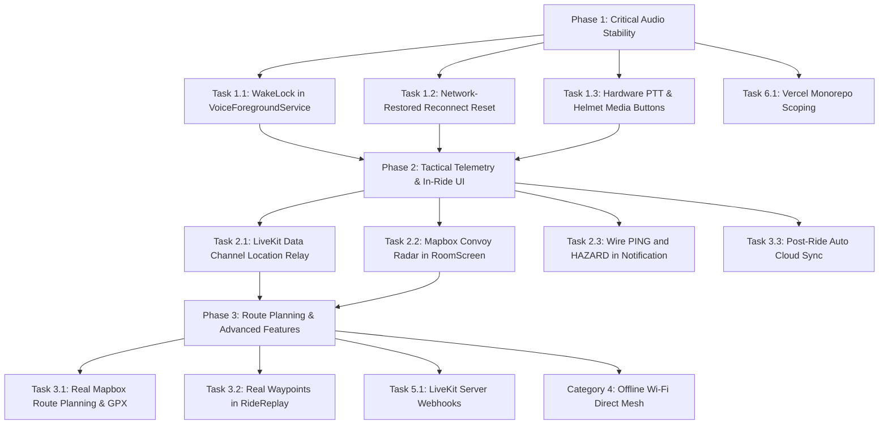

# Rider Voice — Master System Roadmap & Task Implementation Blueprint

This document provides a comprehensive, component-by-component audit of everything currently missing, incomplete, or stubbed out across the **Rider Voice** platform (**Android Mobile App**, **Backend API**, and **Web Dashboard**).

For each missing item, this blueprint documents:
1. **What is missing / stubbed**
2. **Why it matters (Rider UX & Technical Rationale)**
3. **Where in the code (Files, Classes, Methods, Line Ranges)**
4. **How it will work (Architecture & Data Flow)**
5. **How to add it (Step-by-Step Implementation & Code)**
6. **Priority, Dependencies & Validation Criteria**

---

## Master Architecture & Gap Matrix

| ID | Domain | Component / Feature | Current State | Priority | Target Milestone |
|---|---|---|---|---|---|
| **A-1** | Audio / Service | Background `WakeLock` in `VoiceForegroundService` | Declared but never acquired (causes CPU sleep kills) | **P0 (Critical)** | v0.0.3.2 |
| **A-2** | VoIP / Network | Auto-Reset Reconnect Backoff on Network Restored | Stops reconnecting forever after 10 attempts | **P0 (Critical)** | v0.0.3.2 |
| **A-3** | Audio / Hardware | Hardware Handlebar / Helmet PTT Media Button | Unwired class with obsolete audio focus call | **P1 (High)** | v0.0.3.2 |
| **A-4** | Audio / Settings | Connect `HeadsetSettingsScreen` to Pipeline | Writes to unread, unencrypted SharedPreferences | **P1 (High)** | v0.0.3.2 |
| **A-5** | Audio / UI | Audio Route Picker Dialog in `RoomScreen` | Dialog options are empty no-ops | **P1 (High)** | v0.0.3.2 |
| **A-6** | Audio / VOX | Live Reactivity to Settings in Active Call | Settings only read once at ride launch | **P2 (Medium)** | v0.0.4.0 |
| **A-7** | Audio / WebRTC | Single WebRTC Capture Sink vs Dual `AudioRecord` | Runs two concurrent `AudioRecord` hardware captures | **P2 (Research)** | v0.0.4.0 |
| **T-1** | Convoy / Telemetry | LiveKit Data Channel Peer Location & Hazard Relay | LiveKit data packets enabled on backend, unused in app | **P1 (High)** | v0.0.3.3 |
| **T-2** | Convoy / UI | In-Ride Mapbox Convoy Radar in `RoomScreen` | Shows static text with external Google Maps launch | **P1 (High)** | v0.0.3.3 |
| **T-3** | Service / Notification | Tactical Notification "PING" and "HAZARD" Stubs | Empty `when` branches in foreground service | **P1 (High)** | v0.0.3.3 |
| **T-4** | Convoy / Core | Replace Dummy Stubs (`RoomStateSynchronizer`, etc.) | 9-line non-networked in-memory maps | **P2 (Medium)** | v0.0.4.0 |
| **R-1** | Navigation | Real GPS & Mapbox Routing in `RoutePlannerViewModel` | Hardcoded mock riders and static 123 km route | **P2 (Medium)** | v0.0.4.0 |
| **R-2** | Telemetry | Real Waypoint Loading in `RideReplayScreen` | Generates fake sine-wave path when opened | **P2 (Medium)** | v0.0.3.3 |
| **R-3** | Cloud Sync | Automatic Cloud Sync in `PostRideSummaryViewModel` | `save()` only clears local state without uploading | **P1 (High)** | v0.0.3.3 |
| **R-4** | Telemetry | Dynamic Speed & Elevation Charts in `RideStats` | Uses static mock list or empty list | **P2 (Medium)** | v0.0.4.0 |
| **M-1** | Offline Mesh | Complete Signaling in `WifiDirectManager` | Socket loop stops at `readUTF()` without parsing SDP | **P3 (Experimental)** | v0.1.0.0 |
| **M-2** | Offline Mesh | Wire `NetworkHandoffManager` to `LiveKitManager` | Unreferenced class using wrong engine parameter | **P3 (Experimental)** | v0.1.0.0 |
| **B-1** | Backend / LiveKit | LiveKit Webhook Handler for Room & Member Events | No webhook listener; DB doesn't know when room ends | **P1 (High)** | v0.0.3.3 |
| **B-2** | Backend / Infra | Distributed Redis Rate Limiter & Token Caching | In-memory `Map` resets on server restart | **P2 (Medium)** | v0.0.4.0 |
| **W-1** | Web / DevOps | Vercel Monorepo Ignored Build Step | Mobile/backend commits trigger broken web deploys | **P0 (Immediate)** | v0.0.3.2 |
| **W-2** | Web / Spectator | Live Convoy Radar & Telemetry on Web Dashboard | Static CSS mockup with dummy SVG route | **P3 (Feature)** | v0.1.0.0 |

---

## Category 1: Audio, VoIP & Hardware Controls

### Task 1.1: Background `WakeLock` in `VoiceForegroundService`
- **Current State**: In [`VoiceForegroundService.kt`](file:///c:/Users/umerz/OneDrive/Desktop/Rider_APP-main/Rider_APP-main/mobile-app/app/src/main/java/com/ridervoice/services/VoiceForegroundService.kt), `wakeLock` is declared as a nullable field (`private var wakeLock: PowerManager.WakeLock? = null`) and cleaned up in `onDestroy()`, but **it is never initialized or acquired** in `onCreate()`.
- **Why It Matters**: When a rider mounts their phone in a tank bag or puts it into a leather jacket pocket, Android turns the screen off. Within 30–60 seconds, the OS initiates Doze mode and throttles CPU execution. While the foreground service keeps the process alive, the high-speed polling in [`VoxEngine.kt`](file:///c:/Users/umerz/OneDrive/Desktop/Rider_APP-main/Rider_APP-main/mobile-app/app/src/main/java/com/ridervoice/audio/VoxEngine.kt) (every 20 ms) and WebRTC audio threads suffer high jitter, stutter, or complete audio loss.
- **Where**:
  - File: [`VoiceForegroundService.kt`](file:///c:/Users/umerz/OneDrive/Desktop/Rider_APP-main/Rider_APP-main/mobile-app/app/src/main/java/com/ridervoice/services/VoiceForegroundService.kt#L47-L65)
  - Method: `onCreate()`
- **How It Works**:
  1. Acquire a `PowerManager.PARTIAL_WAKE_LOCK`.
  2. Set `setReferenceCounted(false)` to prevent crash on unexpected release calls.
  3. Acquire with a 10-hour safety limit (a typical full motorcycle day ride).
- **How to Implement**:
  ```kotlin
  // Inside VoiceForegroundService.kt -> onCreate()
  val powerManager = getSystemService(Context.POWER_SERVICE) as PowerManager
  wakeLock = powerManager.newWakeLock(
      PowerManager.PARTIAL_WAKE_LOCK,
      "RiderVoice:VoiceAudioLock"
  ).apply {
      setReferenceCounted(false)
      acquire(10 * 3600 * 1000L) // 10-hour safety ceiling
  }
  ```

---

### Task 1.2: Network-Restored Reconnect Reset in `LiveKitManager`
- **Current State**: In [`LiveKitManager.kt`](file:///c:/Users/umerz/OneDrive/Desktop/Rider_APP-main/Rider_APP-main/mobile-app/app/src/main/java/com/ridervoice/network/LiveKitManager.kt), reconnection backoff increments up to `MAX_RECONNECT_ATTEMPTS = 10`. If a ride goes through a tunnel or mountain valley without cell reception for more than 4 minutes, all 10 retries fail, transitioning to `ConnectionState.FAILED`. When cellular signal returns, the app remains permanently dead until the rider pulls over, takes off gloves, and taps Leave/Rejoin.
- **Why It Matters**: Motorcycle routes regularly pass through cellular blackouts. Reconnection must happen automatically without touching the screen.
- **Where**:
  - Files:
    - [`LiveKitManager.kt`](file:///c:/Users/umerz/OneDrive/Desktop/Rider_APP-main/Rider_APP-main/mobile-app/app/src/main/java/com/ridervoice/network/LiveKitManager.kt)
    - [`NetworkResilienceManager.kt`](file:///c:/Users/umerz/OneDrive/Desktop/Rider_APP-main/Rider_APP-main/mobile-app/app/src/main/java/com/ridervoice/network/NetworkResilienceManager.kt)
- **How It Works**:
  1. [`NetworkResilienceManager.kt`](file:///c:/Users/umerz/OneDrive/Desktop/Rider_APP-main/Rider_APP-main/mobile-app/app/src/main/java/com/ridervoice/network/NetworkResilienceManager.kt) monitors `ConnectivityManager.NetworkCallback`.
  2. When network transitions back to `NetworkHealth.CONNECTED`, notify `LiveKitManager.onNetworkRestored()`.
  3. If currently in `FAILED` or `RECONNECTING`, reset `reconnectAttempts = 0` and trigger immediate reconnect using cached credentials (`lastUrl`, `lastToken`).
- **How to Implement**:
  ```kotlin
  // In LiveKitManager.kt:
  fun onNetworkRestored() {
      if (_connectionState.value == ConnectionState.FAILED && lastUrl.isNotBlank() && lastToken.isNotBlank()) {
          Log.i(TAG, "Network restored — resetting retry counter and auto-reconnecting")
          reconnectAttempts = 0
          scope.launch { connectInternal(lastUrl, lastToken) }
      }
  }

  // In RoomViewModel.kt init:
  viewModelScope.launch {
      networkResilienceManager.networkHealth.collect { health ->
          if (health == NetworkHealth.CONNECTED) {
              liveKitManager.onNetworkRestored()
          }
      }
  }
  ```

---

### Task 1.3: Wire `HardwarePTTManager` for Handlebar & Helmet Remotes
- **Current State**: [`HardwarePTTManager.kt`](file:///c:/Users/umerz/OneDrive/Desktop/Rider_APP-main/Rider_APP-main/mobile-app/app/src/main/java/com/ridervoice/audio/HardwarePTTManager.kt) implements media button event listening via `MediaSessionCompat`, but:
  1. It is never instantiated or invoked in [`RoomViewModel.kt`](file:///c:/Users/umerz/OneDrive/Desktop/Rider_APP-main/Rider_APP-main/mobile-app/app/src/main/java/com/ridervoice/state/RoomViewModel.kt).
  2. It has an outdated direct call to `audioManager.requestAudioFocus()`, violating the Single Audio Owner rule (only [`AudioDeviceRouter.kt`](file:///c:/Users/umerz/OneDrive/Desktop/Rider_APP-main/Rider_APP-main/mobile-app/app/src/main/java/com/ridervoice/audio/AudioDeviceRouter.kt) may manage audio focus).
- **Why It Matters**: Riders cannot operate touchscreen buttons while wearing riding gloves at 100 km/h. Helmet systems (Sena Jog Dial, Cardo Roller, FreedConn) and Bluetooth handlebar remotes send AVRCP `KEYCODE_HEADSETHOOK` and `KEYCODE_MEDIA_PLAY_PAUSE` commands.
- **Where**:
  - Files:
    - [`HardwarePTTManager.kt`](file:///c:/Users/umerz/OneDrive/Desktop/Rider_APP-main/Rider_APP-main/mobile-app/app/src/main/java/com/ridervoice/audio/HardwarePTTManager.kt)
    - [`RoomViewModel.kt`](file:///c:/Users/umerz/OneDrive/Desktop/Rider_APP-main/Rider_APP-main/mobile-app/app/src/main/java/com/ridervoice/state/RoomViewModel.kt)
- **How to Implement**:
  1. Remove `audioManager.requestAudioFocus(...)` from `HardwarePTTManager.kt`.
  2. Inject `HardwarePTTManager` into `RoomViewModel`.
  3. In `RoomViewModel.joinRoom()`:
     ```kotlin
     hardwarePTTManager.onMicToggleRequest = { open ->
         liveKitManager.onPttPressed(open)
     }
     hardwarePTTManager.activateSession()
     ```
  4. In `RoomViewModel.cleanup()`:
     ```kotlin
     hardwarePTTManager.deactivateSession()
     ```

---

### Task 1.4: Connect `HeadsetSettingsScreen` to `SecurePreferences` & Pipeline
- **Current State**: [`HeadsetSettingsScreen.kt`](file:///c:/Users/umerz/OneDrive/Desktop/Rider_APP-main/Rider_APP-main/mobile-app/app/src/main/java/com/ridervoice/ui/screens/HeadsetSettingsScreen.kt) writes configuration options (`enableHardwarePtt`, `hybridVoxMode`, `strictDebounce`, `enhancedCompatibility`) to an unencrypted, detached `context.getSharedPreferences("headset_prefs", Context.MODE_PRIVATE)`. Nothing else in the app reads these preferences.
- **Why It Matters**: Users configuring their headset controls assume their choices take effect. Currently, changing these toggles has zero effect on the audio routing or PTT engine.
- **Where**:
  - Screen: [`HeadsetSettingsScreen.kt`](file:///c:/Users/umerz/OneDrive/Desktop/Rider_APP-main/Rider_APP-main/mobile-app/app/src/main/java/com/ridervoice/ui/screens/HeadsetSettingsScreen.kt)
  - Preferences: [`SecurePreferences.kt`](file:///c:/Users/umerz/OneDrive/Desktop/Rider_APP-main/Rider_APP-main/mobile-app/app/src/main/java/com/ridervoice/security/SecurePreferences.kt)
  - Consumers: [`HardwarePTTManager.kt`](file:///c:/Users/umerz/OneDrive/Desktop/Rider_APP-main/Rider_APP-main/mobile-app/app/src/main/java/com/ridervoice/audio/HardwarePTTManager.kt), [`AudioDeviceRouter.kt`](file:///c:/Users/umerz/OneDrive/Desktop/Rider_APP-main/Rider_APP-main/mobile-app/app/src/main/java/com/ridervoice/audio/AudioDeviceRouter.kt)
- **How to Implement**:
  1. Add getters and setters for `isHardwarePttEnabled()`, `isHybridVoxEnabled()`, and `isScoDebounceStrict()` inside `SecurePreferences.kt`.
  2. Inject `SecurePreferences` into `HeadsetSettingsScreen.kt` (or create `HeadsetSettingsViewModel`).
  3. In `HardwarePTTManager.kt`, check `securePreferences.isHardwarePttEnabled()` before handling media button key events.

---

### Task 1.5: Fix Audio Route Picker Dialog in `RoomScreen`
- **Current State**: In [`RoomScreen.kt`](file:///c:/Users/umerz/OneDrive/Desktop/Rider_APP-main/Rider_APP-main/mobile-app/app/src/main/java/com/ridervoice/ui/screens/RoomScreen.kt#L282-L330), tapping the audio device badge opens an "AUDIO OUTPUT ROUTE" modal listing:
  - "Helmet Headset (Bluetooth SCO)"
  - "Phone Speakerphone"
  - "Phone Earpiece / Wired"
  Each `clickable` handler only executes `{ showAudioRoutePicker = false }` without triggering device selection.
- **Why It Matters**: Riders cannot switch between helmet Bluetooth intercom and phone speaker if routing needs manual override.
- **Where**:
  - UI: [`RoomScreen.kt`](file:///c:/Users/umerz/OneDrive/Desktop/Rider_APP-main/Rider_APP-main/mobile-app/app/src/main/java/com/ridervoice/ui/screens/RoomScreen.kt#L282-L330)
  - ViewModel: [`RoomViewModel.kt`](file:///c:/Users/umerz/OneDrive/Desktop/Rider_APP-main/Rider_APP-main/mobile-app/app/src/main/java/com/ridervoice/state/RoomViewModel.kt)
  - Router: [`AudioDeviceRouter.kt`](file:///c:/Users/umerz/OneDrive/Desktop/Rider_APP-main/Rider_APP-main/mobile-app/app/src/main/java/com/ridervoice/audio/AudioDeviceRouter.kt)
- **How to Implement**:
  1. Add `setAudioRoute(deviceType: Int)` to `RoomViewModel`.
  2. Wire `setAudioRoute` to [`AudioDeviceRouter.kt`](file:///c:/Users/umerz/OneDrive/Desktop/Rider_APP-main/Rider_APP-main/mobile-app/app/src/main/java/com/ridervoice/audio/AudioDeviceRouter.kt) communication device API (`AudioDeviceInfo.TYPE_BLUETOOTH_SCO`, `TYPE_BUILTIN_SPEAKER`, `TYPE_BUILTIN_EARPIECE`).
  3. Call `viewModel.setAudioRoute(...)` inside the dialog option clicks before closing the modal.

---

### Task 1.6: Single WebRTC Capture Sink vs Dual `AudioRecord` (Step 9a Research)
- **Current Architecture**:
  1. [`VoxEngine.kt`](file:///c:/Users/umerz/OneDrive/Desktop/Rider_APP-main/Rider_APP-main/mobile-app/app/src/main/java/com/ridervoice/audio/VoxEngine.kt): Dedicated `AudioRecord` at 16 kHz `VOICE_COMMUNICATION` calculating RMS and noise floor.
  2. LiveKit SDK WebRTC: Second internal `AudioRecord` capturing audio for Opus encoding and SFU transmission.
- **Problem**: Running two concurrent hardware capture instances increases CPU usage and can cause audio contention on budget Android chipsets or Bluetooth SCO profiles.
- **Feasibility Verification**:
  - Does LiveKit's `LocalAudioTrack` or WebRTC audio sink receive audio frames when `setMicrophoneEnabled(false)` (muted)?
  - **Result**: In WebRTC, muting a `LocalAudioTrack` stops audio frame delivery to the sink or replaces frames with digital silence (zeros).
  - **Architectural Conclusion**: Because VOX needs to detect voice *while muted* in order to decide when to unmute, a separate capture thread or raw hardware hook *must* be maintained during VOX mode, OR WebRTC capture must remain active while the track is muted via Opus packet suppression. Keep the existing isolated `VoxEngine.audioRecord` capture with try/catch fallback (as completed in Step 5/6) as the safest production architecture.

---

## Category 2: Real-Time Convoy Data, Mapping & Tactical HUD

### Task 2.1: LiveKit Data Channel Peer Location & Hazard Relay
- **Current State**: The backend generates LiveKit access tokens with `canPublishData: true` enabled in [`roomRoutes.js`](file:///c:/Users/umerz/OneDrive/Desktop/Rider_APP-main/Rider_APP-main/backend/src/routes/roomRoutes.js#L54). However, [`LiveKitManager.kt`](file:///c:/Users/umerz/OneDrive/Desktop/Rider_APP-main/Rider_APP-main/mobile-app/app/src/main/java/com/ridervoice/network/LiveKitManager.kt) only handles audio tracks and never calls `room.localParticipant.publishData()`.
- **Why It Matters**: Convoys need to see rider locations on a radar screen, receive PTT transmission indicators, and broadcast instant road hazard warnings (potholes, debris, police, emergency stops) with ultra-low WebRTC latency (< 50 ms) without taxing backend REST databases.
- **Where**:
  - Mobile App:
    - [`LiveKitManager.kt`](file:///c:/Users/umerz/OneDrive/Desktop/Rider_APP-main/Rider_APP-main/mobile-app/app/src/main/java/com/ridervoice/network/LiveKitManager.kt)
    - [`RoomViewModel.kt`](file:///c:/Users/umerz/OneDrive/Desktop/Rider_APP-main/Rider_APP-main/mobile-app/app/src/main/java/com/ridervoice/state/RoomViewModel.kt)
    - [`LocationService.kt`](file:///c:/Users/umerz/OneDrive/Desktop/Rider_APP-main/Rider_APP-main/mobile-app/app/src/main/java/com/ridervoice/services/LocationService.kt)
- **Data Packet Schema (JSON / Protobuf)**:
  ```json
  {
    "type": "LOCATION_UPDATE",
    "uid": "user_123",
    "lat": 18.742,
    "lng": 73.401,
    "speed": 22.5,
    "heading": 142.0,
    "timestamp": 1727980000000
  }
  ```
  ```json
  {
    "type": "TACTICAL_HAZARD",
    "senderUid": "user_123",
    "hazardType": "POTHOLE", // "DEBRIS" | "POLICE" | "STOPPED_VEHICLE"
    "lat": 18.745,
    "lng": 73.403
  }
  ```
- **How to Implement**:
  1. In `LiveKitManager.kt`, register a data listener:
     ```kotlin
     room.events.collect { event ->
         when (event) {
             is RoomEvent.DataReceived -> {
                 val payload = event.data.decodeToString()
                 handleIncomingDataPacket(payload, event.participant?.identity)
             }
         }
     }
     ```
  2. Expose `publishDataMessage(payload: String)` using `room.localParticipant.publishData(payload.toByteArray(), DataTopic.RELIABLE)`.
  3. In `RoomViewModel.kt`, collect `locationService.currentLocation` and broadcast location updates every 3–5 seconds to all connected convoy members over the data channel.

---

### Task 2.2: In-Ride Mapbox Convoy Radar in `RoomScreen`
- **Current State**: [`RoomScreen.kt`](file:///c:/Users/umerz/OneDrive/Desktop/Rider_APP-main/Rider_APP-main/mobile-app/app/src/main/java/com/ridervoice/ui/screens/RoomScreen.kt#L343-L365) displays a placeholder icon (`Icons.Default.Navigation`) and a button that launches external Google Maps with an empty query `google.navigation:q=`.
- **Why It Matters**: The core value proposition of Rider Voice is knowing where your group is in real time without leaving the voice channel.
- **Where**:
  - Screen: [`RoomScreen.kt`](file:///c:/Users/umerz/OneDrive/Desktop/Rider_APP-main/Rider_APP-main/mobile-app/app/src/main/java/com/ridervoice/ui/screens/RoomScreen.kt)
  - ViewModel: [`RoomViewModel.kt`](file:///c:/Users/umerz/OneDrive/Desktop/Rider_APP-main/Rider_APP-main/mobile-app/app/src/main/java/com/ridervoice/state/RoomViewModel.kt)
- **How to Implement**:
  1. Embed Mapbox Compose `MapboxMap` into `RoomScreen.kt` (using the same pattern already implemented in [`RoutePlannerScreen.kt`](file:///c:/Users/umerz/OneDrive/Desktop/Rider_APP-main/Rider_APP-main/mobile-app/app/src/main/java/com/ridervoice/ui/screens/RoutePlannerScreen.kt#L221)).
  2. Render the user's current GPS location with an orientation heading cone.
  3. Render remote participant markers received from `remoteLocations` (received via Task 2.1 LiveKit Data Channel).
  4. Highlight the active speaker marker with an animated cyan pulse ring.

---

### Task 2.3: Wire "PING" and "HAZARD" in Tactical Notification
- **Current State**: In [`VoiceForegroundService.kt`](file:///c:/Users/umerz/OneDrive/Desktop/Rider_APP-main/Rider_APP-main/mobile-app/app/src/main/java/com/ridervoice/services/VoiceForegroundService.kt#L98-L103), the `onStartCommand()` branches for `ACTION_PING` and `ACTION_HAZARD` are completely empty stubs.
- **Why It Matters**: The Android tactical notification provides quick-access buttons directly on the rider's lock screen or notification shade. Tapping them currently does nothing.
- **Where**:
  - File: [`VoiceForegroundService.kt`](file:///c:/Users/umerz/OneDrive/Desktop/Rider_APP-main/Rider_APP-main/mobile-app/app/src/main/java/com/ridervoice/services/VoiceForegroundService.kt#L98-L103)
- **How to Implement**:
  1. `ACTION_PING`: Broadcast an audio chirp tone or TTS alert ("Lead rider pinged group") to the room data channel.
  2. `ACTION_HAZARD`: Fetch latest GPS fix from `LocationService` and broadcast a `HAZARD_ALERT` packet to all riders with an audio chime.

---

## Category 3: Route Planning, Telemetry Replay & Ride Sync

### Task 3.1: Connect `RoutePlannerViewModel` to Mapbox Directions API
- **Current State**: In [`RoutePlannerViewModel.kt`](file:///c:/Users/umerz/OneDrive/Desktop/Rider_APP-main/Rider_APP-main/mobile-app/app/src/main/java/com/ridervoice/ui/viewmodels/RoutePlannerViewModel.kt):
  - Mock riders: `"MotoGhost"`, `"ApexHunter"`, `"TwistiesKing"`.
  - Mock position: `"Current GPS Position (18.74° N, 73.40° E)"`.
  - Mock calculations: `distanceKm = "123"`, `duration = "02:40"`.
  - `saveRoute()` only executes `onSaved()` without storing anything.
- **Why It Matters**: Riders cannot plan real routes or export GPX files.
- **Where**:
  - File: [`RoutePlannerViewModel.kt`](file:///c:/Users/umerz/OneDrive/Desktop/Rider_APP-main/Rider_APP-main/mobile-app/app/src/main/java/com/ridervoice/ui/viewmodels/RoutePlannerViewModel.kt)
- **How to Implement**:
  1. Inject `LocationService` into `RoutePlannerViewModel`.
  2. Use Mapbox Navigation / Directions SDK or Mapbox REST API (`/directions/v5/mapbox/driving-traffic`) to calculate polyline, distance, and duration between origin and destination coordinates.
  3. Save planned routes into Room database (`PlannedRouteEntity`).
  4. Generate and write `.gpx` XML track to `Environment.DIRECTORY_DOWNLOADS` when "Export GPX Track" is tapped.

---

### Task 3.2: Wire `RideReplayScreen` to Real Historical Waypoints
- **Current State**: In [`RideReplayScreen.kt`](file:///c:/Users/umerz/OneDrive/Desktop/Rider_APP-main/Rider_APP-main/mobile-app/app/src/main/java/com/ridervoice/ui/screens/RideReplayScreen.kt#L51-L63), if `waypoints` is empty, it generates a fake sinusoidal path (`lat = 18.74 + 0.05 * Math.sin(...)`). When navigating to this screen from ride history, no waypoints are passed.
- **Why It Matters**: Telemetry replay displays fake data instead of the rider's actual recorded GPS ride track.
- **Where**:
  - Screen: [`RideReplayScreen.kt`](file:///c:/Users/umerz/OneDrive/Desktop/Rider_APP-main/Rider_APP-main/mobile-app/app/src/main/java/com/ridervoice/ui/screens/RideReplayScreen.kt)
  - Database: [`RideDao.kt`](file:///c:/Users/umerz/OneDrive/Desktop/Rider_APP-main/Rider_APP-main/mobile-app/app/src/main/java/com/ridervoice/data/local/RideDao.kt)
- **How to Implement**:
  1. Create `RideReplayViewModel(rideDao: RideDao)` with `getWaypoints(rideId: String)`.
  2. Query `rideDao.getWaypointsForSession(rideId)` and `rideDao.getEventsForSession(rideId)`.
  3. Bind real waypoint coordinates, timestamps, and speeds to the playback scrubber.

---

### Task 3.3: Automatic Cloud Sync in `PostRideSummaryViewModel`
- **Current State**: In [`PostRideSummaryViewModel.kt`](file:///c:/Users/umerz/OneDrive/Desktop/Rider_APP-main/Rider_APP-main/mobile-app/app/src/main/java/com/ridervoice/ui/viewmodels/PostRideSummaryViewModel.kt), `save()` only executes `rideRecorder.clearSummary()` without uploading the session to [`ApiService.syncRide()`](file:///c:/Users/umerz/OneDrive/Desktop/Rider_APP-main/Rider_APP-main/mobile-app/app/src/main/java/com/ridervoice/network/ApiService.kt#L87).
- **Why It Matters**: Completed rides are kept only in local SQLite and do not sync to backend PostgreSQL / Supabase, meaning they cannot appear in the web dashboard or team leaderboard.
- **Where**:
  - File: [`PostRideSummaryViewModel.kt`](file:///c:/Users/umerz/OneDrive/Desktop/Rider_APP-main/Rider_APP-main/mobile-app/app/src/main/java/com/ridervoice/ui/viewmodels/PostRideSummaryViewModel.kt)
- **How to Implement**:
  1. Inject `ApiService` and `RideDao` into `PostRideSummaryViewModel`.
  2. In `save()`, launch coroutine to upload session metadata via `apiService.syncRide(SyncRideRequest(...))`.
  3. Mark `isSynced = true` in local database upon success.

---

## Category 4: Offline Mesh Intercom (Wi-Fi Direct P2P WebRTC)

### Task 4.1 & 4.2: Complete Signaling and Orchestration
- **Current State**:
  - [`LocalMeshVoiceEngine.kt`](file:///c:/Users/umerz/OneDrive/Desktop/Rider_APP-main/Rider_APP-main/mobile-app/app/src/main/java/com/ridervoice/audio/LocalMeshVoiceEngine.kt) contains WebRTC P2P setup via `PeerConnectionFactory`.
  - [`WifiDirectManager.kt`](file:///c:/Users/umerz/OneDrive/Desktop/Rider_APP-main/Rider_APP-main/mobile-app/app/src/main/java/com/ridervoice/audio/WifiDirectManager.kt#L139-L143) starts a ServerSocket on port 8888, reads string payloads, but does nothing with them.
  - [`NetworkHandoffManager.kt`](file:///c:/Users/umerz/OneDrive/Desktop/Rider_APP-main/Rider_APP-main/mobile-app/app/src/main/java/com/ridervoice/audio/NetworkHandoffManager.kt) takes `VoxEngine` instead of `LiveKitManager` and is never wired to the application lifecycle.
- **Why It Matters**: In remote off-road areas with zero cell tower coverage, Wi-Fi Direct mesh provides an offline rider-to-rider intercom up to 150 meters range.
- **Where**:
  - [`WifiDirectManager.kt`](file:///c:/Users/umerz/OneDrive/Desktop/Rider_APP-main/Rider_APP-main/mobile-app/app/src/main/java/com/ridervoice/audio/WifiDirectManager.kt)
  - [`LocalMeshVoiceEngine.kt`](file:///c:/Users/umerz/OneDrive/Desktop/Rider_APP-main/Rider_APP-main/mobile-app/app/src/main/java/com/ridervoice/audio/LocalMeshVoiceEngine.kt)
  - [`NetworkHandoffManager.kt`](file:///c:/Users/umerz/OneDrive/Desktop/Rider_APP-main/Rider_APP-main/mobile-app/app/src/main/java/com/ridervoice/audio/NetworkHandoffManager.kt)
- **How to Implement**:
  1. Define JSON signaling protocol for P2P SDP Offer, Answer, and ICE Candidates.
  2. When Wi-Fi Direct connection is established, the elected Group Owner runs the signaling relay.
  3. When cellular internet drops for > 30 seconds, `NetworkHandoffManager` triggers offline mesh fallback.

---

## Category 5: Backend & Infrastructure

### Task 5.1: LiveKit Webhook Handler
- **Current State**: Backend handles token generation in [`roomRoutes.js`](file:///c:/Users/umerz/OneDrive/Desktop/Rider_APP-main/Rider_APP-main/backend/src/routes/roomRoutes.js), but has no webhook handler to receive server events from the LiveKit server.
- **Why It Matters**: When all riders disconnect or the room expires, backend PostgreSQL `Room` and `RideSession` statuses remain marked as "Active" indefinitely.
- **Where**:
  - File: `backend/src/routes/webhookRoutes.js` (to be created)
- **How to Implement**:
  ```javascript
  const { WebhookReceiver } = require('livekit-server-sdk');
  const receiver = new WebhookReceiver(process.env.LIVEKIT_API_KEY, process.env.LIVEKIT_API_SECRET);

  router.post('/api/livekit/webhook', async (req, res) => {
      const event = await receiver.receive(req.body, req.headers['authorization']);
      if (event.event === 'room_finished') {
          await prisma.room.update({
              where: { name: event.room.name },
              data: { status: 'ENDED', endedAt: new Date() }
          });
      }
      res.status(200).send('OK');
  });
  ```

---

## Category 6: Web Dashboard & DevOps

### Task 6.1: Vercel Ignored Build Step for Monorepo Scoping
- **Current State**: The repository is a monorepo containing `mobile-app`, `backend`, and `web-app`. Vercel is connected to the root repo and attempts to build the web dashboard on every commit (including Android-only commits), causing build errors.
- **Why It Matters**: Pull requests and main branch commits show false red checkmarks on GitHub.
- **How to Resolve**:
  1. In the Vercel Dashboard -> Project Settings -> General:
     - Set **Root Directory** to `web-app`.
  2. In Vercel Dashboard -> Project Settings -> Git -> **Ignored Build Step**:
     - Set command to:
       ```bash
       git diff HEAD^ HEAD --quiet .
       ```
     - If no files inside `web-app/` changed, Vercel skips the build with exit code 0 (passing status).

---

## Step-by-Step Implementation Sequence



---

## Physical Hardware Field Testing Matrix

| Test Case | Scenario | Procedure | Acceptance Pass Criteria |
|---|---|---|---|
| **FT-01** | Screen-Off Audio Stability | Lock phone, ride for 15 minutes with voice active | Audio does not cut out; WakeLock prevents CPU Doze kills |
| **FT-02** | Tunnel Blackout Recovery | Drive into cellular dead zone (or toggle Airplane Mode 60s) | When 4G/5G returns, app reconnects automatically without touching phone |
| **FT-03** | Helmet Button PTT | Press Sena Jog Dial / Cardo button while wearing gloves | Mic opens, active speaker indicator turns green, mic closes on release/toggle |
| **FT-04** | Tactical Notification Mute/Ping | Tap Mute and Ping directly on Android lock screen notification | Audio mutes/unmutes immediately; remote riders hear tactical alert tone |
| **FT-05** | Ride Sync to Web Dashboard | End ride, tap SAVE on summary screen | Session appears immediately on web admin `/admin/rides` roster |
