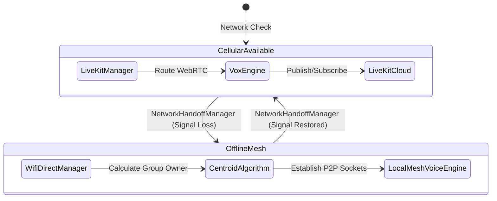

# Rider Voice

Rider Voice is a hyper-premium, real-time communication system and mobile application tailored for motorcycle riders. It provides active voice communications, real-time route planning, and ride statistics.

## Dual-Engine Intercom Architecture
Rider Voice utilizes a hybrid **Dual-Engine** communication model. It seamlessly hands off between a cloud-based Selective Forwarding Unit (SFU) for infinite range and an offline Wi-Fi Direct Mesh for localized mountainous terrain where cell service drops.



## Core Features
- **Failproof Comms**: The Dual-Engine architecture guarantees connection whether you are on a 5G highway or in an offline mountain pass.
- **Centroid Mesh Routing**: Automatically calculates the geographic center of the squad and elects the middle rider to act as the Wi-Fi Direct router to maximize range.
- **Universal Hardware Support**: Custom Bluetooth SCO routing ensures compatibility with Cardo, Sena, and standard Type-C wired helmet intercoms.
- **Audio Ducking**: Automatically fades your Spotify music into the background when a squad member speaks.
- **Flight Recorder**: Real-time graphing and local Room Database recording of speed, total distance, and elevation.

## Documentation
- For a deep dive into the file structure, classes, and logic, read the [ARCHITECTURE.md](ARCHITECTURE.md) guide.

## Getting Started
1. Open the `/mobile-app` folder in Android Studio (do **not** open the root monorepo folder).
2. Ensure you have added your `google-services.json` file for Firebase Authentication support.
3. Sync Gradle and build the project.
4. Run the app on a physical Android device for accurate Bluetooth and WebRTC testing.

---

# Complete Project Documentation

## 1. Project Overview

### 1.1 Project Description
Rider Voice is a hyper-premium, real-time communication platform and Android mobile application tailored exclusively for motorcycle riders. It provides crystal-clear group voice communications, real-time GPS route planning, convoy telemetry, ride recording (Flight Recorder), and emergency SOS alerting — all within a single vertically integrated product that works on 5G highways and in offline mountain passes alike.

### 1.2 Problem Statement
Motorcycle group riding is inherently dangerous and poorly coordinated. Existing Bluetooth mesh intercoms (Cardo, Sena) are limited to 600–1500 m range, fail the moment the squad splits, and cannot survive a loss of cellular data. General-purpose communication apps (WhatsApp, Discord) are not optimised for helmet acoustics, wind noise, or gloved-hand operation. There is no product on the market that seamlessly blends cloud-based unlimited-range voice with an offline P2P fallback, hardware intercom integration, and live ride telemetry.

### 1.3 Objectives
1. Provide unlimited-range group voice communication for motorcycle squads.
2. Offer an automatic fallback to a Wi-Fi Direct mesh when cellular data is unavailable.
3. Integrate natively with Cardo, Sena, and wired Type-C helmet intercoms via Bluetooth SCO.
4. Record real-time ride telemetry (speed, distance, elevation) in a local Flight Recorder database.
5. Enable convoy management via a Host/Joiner lobby flow with FCM push invite delivery.
6. Provide administrators with a live web dashboard for fleet monitoring and data management.
7. Ensure military-grade UX legibility under direct sunlight on a moving motorcycle.

### 1.4 Scope
The Rider Voice system is a monorepo containing four major sub-systems:
- **Android Mobile App** (Kotlin / Jetpack Compose): Primary rider-facing interface
- **Node.js REST Backend** (Express.js / Prisma / Supabase): API gateway, auth, push notifications
- **Next.js Web Admin** (React / Next.js / Supabase): Admin dashboard and landing page
- **LiveKit SFU Server** (Docker / LiveKit): Real-time WebRTC audio routing

### 1.5 Core Features
* **Dual-Engine Voice**: Cloud SFU (LiveKit) + offline Wi-Fi Direct mesh, seamless automatic handoff.
* **Centroid Mesh Routing**: Elects the geographically central rider as the Wi-Fi Direct Group Owner to maximise mesh range.
* **Bluetooth SCO**: Forces VoIP audio profile for full compatibility with Cardo, Sena, and wired helmet mics.
* **Audio Ducking**: Automatically fades background media (Spotify) when a squad member transmits voice.
* **VOX Engine**: Proprietary Voice Activity Detection algorithm tuned for wind and engine noise.
* **Flight Recorder**: Room Database logging of speed, distance, elevation, and convoy events per ride.
* **Ride Replay**: Playback of a saved ride track on a Mapbox map with event annotations.
* **Convoy Lobby**: Host creates convoy → sends FCM push invites → waits in lobby → starts ride.
* **Emergency SOS**: One-tap SOS broadcasts GPS coordinates to entire squad via FCM high-priority push.
* **Web Admin Dashboard**: Next.js admin panel with live KPIs, ride management, user management, and analytics.

### 1.6 Target Users
* Motorcycle riders who perform group rides (convoys) regularly.
* Motorcycle clubs requiring squadron-wide communication infrastructure.
* Adventure touring riders who venture into areas with no cellular coverage.
* Fleet operators who need live tracking and emergency response capability.
* Platform administrators who moderate users, manage data, and monitor system health.

### 1.7 Expected Outcomes
1. A production-ready Android APK downloadable from the public landing page.
2. Zero dropped communications for squads within 600 m when offline.
3. Sub-300 ms voice latency over cellular (LiveKit SFU target).
4. 100% ride data preservation via local Room Database, synced post-ride.
5. An admin dashboard available at the web-app domain for platform operators.

---

## 2. Technology Stack

### 2.1 Android Mobile App
* **Kotlin**: Primary language. Why Chosen: JVM-compatible, concise null-safety, coroutines built-in. Alternatives: Java (verbose). Advantage: First-class Android support, Coroutines, clean syntax.
* **Jetpack Compose**: Declarative UI toolkit. Why Chosen: Eliminates XML layouts, reactive state management. Alternatives: XML Views / Flutter. Advantage: Native Android performance, Compose Material 3.
* **Hilt (Dagger)**: Dependency injection. Why Chosen: Auto-generates dependency graph at compile time. Alternatives: Koin, manual DI. Advantage: Compile-time safety, Android Jetpack integration.
* **LiveKit Android SDK v2.25.3**: WebRTC voice. Why Chosen: Built-in SFU client, handles signalling and ICE. Alternatives: Raw WebRTC, Agora. Advantage: Open-source, self-hostable, low-latency.
* **Retrofit 2 + OkHttp**: HTTP networking. Why Chosen: Type-safe API interfaces, interceptors for auth headers. Alternatives: Ktor, Volley. Advantage: Proven in production, GSON converter support.
* **Room Database v2.6.1**: Local persistence. Why Chosen: SQLite abstraction with Kotlin coroutines, compile-time queries. Alternatives: SQLite raw, Realm. Advantage: Type-safe, Flow support, offline-first.
* **Mapbox Maps SDK v11.2**: Mapping. Why Chosen: Offline map tiles, custom styling, convoy overlay. Alternatives: Google Maps, OSM. Advantage: Offline support, vector tiles, terrain 3D.
* **Firebase Auth**: Authentication. Why Chosen: Google Sign-In + Phone OTP, uid used as primary key. Alternatives: Auth0, Supabase Auth. Advantage: Deep Android integration, free tier.
* **Firebase Crashlytics**: Crash reporting. Why Chosen: Automatic crash capture and symbolication. Alternatives: Sentry, Bugsnag. Advantage: Free, Firebase ecosystem.
* **Firebase Cloud Messaging**: Push notifications. Why Chosen: Data-only FCM for Full-Screen Intent delivery. Alternatives: OneSignal, APNs. Advantage: Android native, reliable delivery.
* **AndroidX Security Crypto**: Secure storage. Why Chosen: EncryptedSharedPreferences for token storage. Alternatives: Jetpack DataStore plain. Advantage: AES-256 encryption at rest.
* **Google Play Services Location**: GPS. Why Chosen: FusedLocationProviderClient adaptive polling. Alternatives: Raw GPS API. Advantage: Battery optimised, high accuracy.
* **Media (AndroidX)**: Bluetooth audio. Why Chosen: AVRCP media session for Play/Pause interception. Alternatives: Manual BroadcastReceiver. Advantage: Documented API, compatibility library.

### 2.2 Backend (Node.js REST API)
* **Node.js v18+**: Runtime. Why Chosen: Non-blocking event loop ideal for I/O-bound API work. Alternatives: Go, Python/FastAPI. Advantage: Ecosystem, Firebase Admin SDK native.
* **Express.js v4**: Web framework. Why Chosen: Minimal, middleware-driven, large ecosystem. Alternatives: Fastify, Koa. Advantage: Ubiquitous, well-documented.
* **Prisma ORM v5.14**: Database ORM. Why Chosen: Type-safe query builder, migration management. Alternatives: Sequelize, Knex. Advantage: TypeScript types, schema-first, migration CLI.
* **Firebase Admin SDK v13**: Auth verification. Why Chosen: Server-side Firebase ID token verification. Alternatives: JWT manual verify. Advantage: Official SDK, always up-to-date.
* **LiveKit Server SDK v2.8**: Token generation. Why Chosen: AccessToken signing for room join authorisation. Alternatives: Custom JWT. Advantage: Official SDK, correct claim format.
* **dotenv v16**: Config management. Why Chosen: Loads .env variables into process.env. Alternatives: config npm, manual. Advantage: Zero-dependency, standard practice.
* **CORS v2.8**: Cross-origin. Why Chosen: Configures HTTP CORS headers. Alternatives: Helmet, custom. Advantage: Simple, Express native.

### 2.3 Web App (Next.js Admin)
* **Next.js 16.2**: React framework. Why Chosen: App Router, Server Components, API routes, SSR. Alternatives: CRA, Vite, Remix. Advantage: File-based routing, server-side Supabase queries.
* **React 19**: UI library. Why Chosen: Component model, hooks, concurrent features. Alternatives: Svelte, Vue. Advantage: Largest ecosystem, team familiarity.
* **TypeScript 5**: Type safety. Why Chosen: Catches bugs at compile time. Alternatives: Plain JavaScript. Advantage: Mandatory for large codebases.
* **Supabase JS v2 + SSR**: Database client. Why Chosen: Manages Postgres RLS and admin queries. Alternatives: Direct pg, Prisma browser. Advantage: Supabase native client with cookie auth.
* **Firebase Client v10**: Auth (web). Why Chosen: Google Sign-In for admin dashboard login. Alternatives: Supabase Auth. Advantage: Matches mobile auth system.
* **Tailwind CSS v4**: Styling. Why Chosen: Utility-first rapid styling. Alternatives: Vanilla CSS, MUI. Advantage: Rapid prototyping, purging.
* **Geist Font**: Typography. Why Chosen: Vercel's design system font. Alternatives: Inter, Roboto. Advantage: Modern, legible, professional.

### 2.4 Infrastructure & DevOps
* **Supabase (PostgreSQL)**: Database. Why Chosen: Managed Postgres with RLS, REST API, admin dashboard. Alternatives: PlanetScale, Neon. Advantage: Free tier, Postgres compliance, Prisma compatible.
* **LiveKit Cloud / Self-hosted**: SFU. Why Chosen: WebRTC Selective Forwarding Unit for group audio. Alternatives: Agora, Twilio. Advantage: Open-source, self-hostable, sub-300ms latency.
* **Render.com**: Backend hosting. Why Chosen: Auto-deploy from GitHub on push, zero-config. Alternatives: Railway, Heroku. Advantage: Free tier, Docker support, render.yaml.
* **Docker**: Containerisation. Why Chosen: LiveKit server run in Docker Compose. Alternatives: Bare metal, Kubernetes. Advantage: Reproducible environment, official LiveKit image.
* **Firebase Console**: Analytics/Crash. Why Chosen: Crashlytics + Analytics dashboard. Alternatives: Datadog, Grafana. Advantage: Free, integrated with Auth and FCM.

---

## 3. Complete File Structure

### 3.1 Repository Root
```
Rider_APP/                         ← Monorepo root
├── .git/                            ← Git version control
├── .gitignore                       ← Files excluded from source control
├── .idea/                           ← JetBrains IDE settings
├── .vscode/                         ← VS Code workspace settings
├── ARCHITECTURE.md                  ← Engineering deep-dive document
├── README.md                        ← Project entry-point README
├── render.yaml                      ← Render.com IaC deployment config
├── backend/                         ← Node.js REST API server
├── livekit-server/                  ← LiveKit SFU Docker configuration
├── mobile-app/                      ← Android application (Kotlin)
└── web-app/                         ← Next.js admin + landing page
```

### 3.2 Backend Structure
```
backend/
├── .env                             ← Active secrets (git-ignored)
├── .env.example                     ← Template for new devs
├── .gitignore
├── Dockerfile                       ← Docker build for backend
├── package.json                     ← NPM manifest
├── package-lock.json
├── supabase_schema.sql              ← Raw SQL schema for reference
├── prisma/
│   └── schema.prisma                ← Prisma data model & ORM config
└── src/
    ├── server.js                    ← Express app entry-point
    ├── db.js                        ← Prisma client singleton
    ├── config/
    │   └── firebaseAdmin.js         ← Firebase Admin SDK initialiser
    ├── middleware/
    │   ├── authMiddleware.js        ← Firebase token verifier
    │   ├── errorMiddleware.js       ← Global error handler
    │   └── rateLimiter.js           ← In-memory IP rate limiter (60 rpm)
    ├── routes/
    │   ├── healthRoute.js           ← GET /api/health (public ping)
    │   ├── userRoutes.js            ← Profile CRUD, FCM token, rider search
    │   ├── friendRoutes.js          ← Friend request, accept, list, pending
    │   ├── inviteRoutes.js          ← Ride invite send, respond, list
    │   ├── roomRoutes.js            ← Legacy quick-join LiveKit token
    │   ├── lobbyRoutes.js           ← Host/Joiner convoy lobby management
    │   ├── rideRoutes.js            ← Ride session sync and history
    │   └── profileRoutes.js        ← Extended profile endpoints
    └── services/
        ├── notificationService.js   ← FCM push delivery + token cleanup
        └── tokenService.js          ← LiveKit token helper utilities
```

### 3.3 Mobile App Structure
```
mobile-app/
├── build.gradle                     ← Root Gradle config
├── settings.gradle                  ← Module declaration
└── app/
    ├── build.gradle                 ← App-level Gradle (deps, plugins, config)
    ├── google-services.json         ← Firebase project config
    └── src/main/java/com/ridervoice/
        ├── App.kt                   ← @HiltAndroidApp, notification channels
        ├── MainActivity.kt          ← Single Activity, Hilt entry point
        ├── audio/
        │   ├── AudioDeviceRouter.kt     ← Bluetooth SCO, audio mode, device routing
        │   ├── AudioFocusManager.kt     ← Spotify ducking, audio focus management
        │   ├── VoxEngine.kt             ← VOX/VAD algorithm, microphone gate
        │   ├── LocalMeshVoiceEngine.kt  ← Offline P2P WebRTC (Wi-Fi Direct mode)
        │   ├── NetworkHandoffManager.kt ← Cloud ↔ Offline mode switch
        │   ├── WifiDirectManager.kt     ← Wi-Fi P2P discovery & centroid election
        │   └── HardwarePTTManager.kt    ← Bluetooth PTT button listener
        ├── network/
        │   ├── ApiService.kt            ← Retrofit interface (all API endpoints)
        │   ├── LiveKitManager.kt        ← LiveKit SDK client wrapper
        │   ├── ConnectionState.kt       ← Sealed class for connection states
        │   ├── NetworkObserver.kt       ← ConnectivityManager flow wrapper
        │   ├── NetworkResilienceManager.kt ← Retry policies
        │   └── ReconnectManager.kt      ← Automatic reconnection logic
        ├── ui/
        │   ├── screens/                 ← 20 Composable screens
        │   ├── viewmodels/              ← Hilt ViewModels
        │   ├── components/              ← Reusable Composable widgets
        │   ├── theme/                   ← Color, Typography, Theme (OLED + Glass)
        │   └── animations/              ← Custom Compose animations
        ├── data/
        │   ├── local/
        │   │   ├── RideDatabase.kt      ← Room database definition
        │   │   └── entities/            ← Room @Entity data classes
        │   └── repository/
        │       └── SquadRepository.kt   ← Data orchestration layer
        ├── navigation/
        │   └── NavGraph.kt              ← Compose NavHost with all routes
        ├── services/
        │   ├── LocationService.kt       ← FusedLocation adaptive GPS polling
        │   ├── VoiceForegroundService.kt← Background mic foreground service
        │   └── RideRecorder.kt          ← Background ride data recording
        ├── di/                          ← Hilt modules
        ├── models/                      ← Kotlin data classes / DTOs
        ├── permissions/                 ← Runtime permission helpers
        ├── security/                    ← EncryptedSharedPreferences wrapper
        ├── monitoring/                  ← Performance & thermal monitoring
        ├── recovery/                    ← Crash recovery strategies
        ├── state/                       ← Global StateFlow / SharedFlow
        ├── sync/                        ← Data sync utilities
        ├── errors/                      ← Custom exception hierarchy
        ├── participants/                ← LiveKit participant models
        └── utils/                       ← Extension functions, OEM warnings
```

### 3.4 Web App Structure
```
web-app/
├── package.json
├── tsconfig.json
├── next.config.ts
├── postcss.config.mjs
├── eslint.config.mjs
├── middleware.ts                    ← Next.js Edge middleware (Supabase session)
├── .env.local                      ← Local environment overrides
├── public/                         ← Static assets (images, icons)
└── src/
    ├── app/
    │   ├── layout.tsx               ← Root layout (Geist fonts, metadata)
    │   ├── page.tsx                 ← Public landing / marketing page
    │   ├── globals.css              ← Global CSS variables and resets
    │   └── admin/
    │       ├── admin.css            ← Admin-specific stylesheet
    │       ├── (auth)/
    │       │   ├── layout.tsx       ← Auth layout (unauthenticated)
    │       │   └── login/           ← Admin login page
    │       └── (app)/
    │           ├── layout.tsx       ← Sidebar + nav layout (authenticated)
    │           ├── page.tsx         ← Dashboard (KPIs, live operations board)
    │           ├── users/           ← User management page
    │           ├── rides/           ← Ride session browser
    │           ├── rooms/           ← Room management
    │           ├── invites/         ← Invite management
    │           ├── roles/           ← Role configuration
    │           ├── reports/         ← Analytics and reports
    │           └── settings/        ← Platform settings
    └── utils/
        ├── firebase/
        │   └── client.ts            ← Firebase client SDK initialiser
        └── supabase/
            └── admin.ts             ← Supabase service-role admin client
```

---

## 4. File Types Used

| Extension | Type | Purpose |
|---|---|---|
| `.kt` | Kotlin source files | Android app — Composable functions, ViewModels, services, data models |
| `.java` | Java source file | TestReflection.java — legacy test harness |
| `.js` | JavaScript | Node.js backend routes, services, middleware, server entry-point |
| `.ts` / `.tsx` | TypeScript / TSX | Next.js pages, components, utilities — type-safe React |
| `.json` | JSON config/data | package.json, tsconfig.json, google-services.json, Firebase service account |
| `.prisma` | Prisma schema | Defines PostgreSQL data models, relations, enums for ORM code-generation |
| `.sql` | SQL script | supabase_schema.sql — reference schema for Supabase table creation |
| `.gradle` | Gradle build script | Android build system — dependencies, signing config, build types |
| `.yaml` / `.yml` | YAML config | render.yaml (Render.com IaC), livekit.yaml (SFU config), docker-compose.yml |
| `.md` | Markdown | README.md, ARCHITECTURE.md, developer docs |
| `.env` | Environment file | Backend secrets: DB URL, Firebase, LiveKit API keys — never committed |
| `.env.example` | Env template | Checked-in template so new devs know which keys are required |
| `.css` | Cascading Style Sheets | globals.css (web app resets), admin.css (admin panel styles) |
| `.mjs` | ES Module JS | next.config.ts, postcss.config.mjs, eslint.config.mjs — config files |
| `.properties` | Java properties | gradle.properties (Gradle flags), local.properties (SDK path — git-ignored) |
| `.xml` | Android XML resources | AndroidManifest.xml, layout XMLs, string resources |
| `.ico` / image | Icon/image assets | favicon.ico, app icons, launch screen images |
| `Dockerfile` | Docker build file | Defines container build for backend and LiveKit server |

---

## 5. Software Architecture

### 5.1 High-Level Architecture Overview
Rider Voice follows a multi-tier, microservice-inspired monorepo architecture with four independent deployable units sharing a common Supabase (PostgreSQL) database and Firebase authentication layer.

```text
┌─────────────────────────────────────────────────────────────────┐
│                         RIDER VOICE SYSTEM                      │
│                                                                 │
│  ┌──────────────┐     HTTPS/REST     ┌─────────────────────┐    │
│  │  Android App │◄──────────────────►│  Node.js Backend    │    │
│  │  (Kotlin)    │                    │  (Express + Prisma) │    │
│  │              │     WebRTC/WSS     │         │           │    │
│  │              │◄──────────────────►│  LiveKit SFU        │    │
│  │              │                    │  (Docker/Cloud)     │    │
│  │              │     FCM Push       │         │           │    │
│  │              │◄──────────────────►│  Firebase Admin     │    │
│  └───────┬──────┘                    └─────────┬───────────┘    │
│          │  Firebase Auth (ID Token)           │ Prisma ORM     │
│          │                                     ▼                │
│  ┌───────▼──────┐                    ┌─────────────────────┐    │
│  │ Firebase Auth│                    │  Supabase/Postgres  │    │
│  │ (Google/OTP) │                    │  (Users, Rides,     │    │
│  └──────────────┘                    │   Rooms, Invites)   │    │
│                                      └─────────────────────┘    │
│  ┌──────────────────────────────────────────────────────────┐   │
│  │  Next.js Web Admin (Admin Dashboard + Marketing Landing) │   │
│  │  Reads Supabase directly via service-role key            │   │
│  └──────────────────────────────────────────────────────────┘   │
└─────────────────────────────────────────────────────────────────┘
```

### 5.2 Dual-Engine Voice Architecture
The core innovation in Rider Voice is the Dual-Engine communication model. The system monitors network connectivity at all times and switches between two independent audio transport layers:
- **Cloud SFU**: WebRTC over TURN/STUN via LiveKit. Unlimited (Internet) range. Used for normal cellular riding. Managed by `LiveKitManager.kt`.
- **Offline Mesh**: Raw WebRTC P2P over Wi-Fi Direct TCP sockets. ~600 m range. Used in mountain/tunnel/no-signal areas. Managed by `LocalMeshVoiceEngine.kt`.

### 5.3 Offline Mesh — Centroid Election Algorithm
When cellular data drops, `NetworkHandoffManager.kt` activates Wi-Fi Direct mode. Because Wi-Fi Direct uses a Group Owner (hotspot) model, the system must elect the rider who can physically reach all other riders. The algorithm:
1. Each rider's Android app continuously updates its GPS coordinates to a shared in-memory cache.
2. `WifiDirectManager.kt` reads the cached coordinates of all discovered peers.
3. It computes the geographic centroid: `centroid_lat = mean(all_lats), centroid_lng = mean(all_lngs)`.
4. The rider whose current position is closest (Haversine distance) to the centroid is elected Group Owner.
5. The Group Owner opens a TCP ServerSocket. All other peers connect as clients.
6. The Group Owner acts as a local SDP relay: it forwards WebRTC Offer/Answer and ICE Candidates between peers.
7. `LocalMeshVoiceEngine.kt` then creates a PeerConnection for each peer and begins streaming raw PCM audio.

### 5.4 Layered Architecture (Mobile App)
| Layer | Components | Responsibility |
|---|---|---|
| UI Layer | Jetpack Compose Screens + ViewModels | Presentation — what the user sees and interacts with |
| Domain/State Layer | StateFlow, ViewModels, Repositories | Business logic, state management, use cases |
| Data Layer | Room DB (local), Retrofit API (remote) | Data persistence and retrieval |
| Audio Layer | VoxEngine, LiveKitManager, AudioRouter | Voice capture, routing, encoding/decoding |
| Network Layer | WifiDirectManager, NetworkHandoffManager | Connectivity monitoring and handoff logic |
| Service Layer | VoiceForegroundService, LocationService | Background OS services |
| DI Layer | Hilt modules and injectors | Dependency graph construction |

### 5.5 Request Flow (Mobile → Backend)
1. User performs action (e.g., tap 'Join Ride').
2. Composable Screen calls a method on the injected ViewModel.
3. ViewModel calls Repository (SquadRepository) or ApiService via Retrofit.
4. Retrofit adds Authorization: Bearer <Firebase ID Token> header via OkHttp interceptor.
5. HTTPS request travels to the Node.js backend.
6. `authMiddleware.js` calls Firebase Admin SDK `verifyIdToken()`.
7. If valid, `req.user` is populated with the decoded claims (uid, email, name).
8. Route handler executes the business logic using Prisma ORM.
9. Prisma translates to a parameterised SQL query against Supabase/PostgreSQL.
10. Response is serialised to JSON and returned to the Android app.
11. Retrofit parses the JSON into the Kotlin data class.
12. ViewModel updates a StateFlow, triggering Compose recomposition.

### 5.6 Authentication Flow
```text
  ┌──────────┐            ┌─────────────────┐          ┌──────────────┐
  │  Rider   │            │   Firebase Auth │          │  Node.js API │
  │  (App)   │            │   (Google/OTP)  │          │  (Render.com)│
  └────┬─────┘            └────────┬────────┘          └──────┬───────┘
       │  1. Google/Phone Sign-In  │                          │
       │──────────────────────────►│                          │
       │  2. Firebase ID Token     │                          │
       │◄──────────────────────────│                          │
       │  3. POST /api/rooms/...   │                          │
       │   Authorization: Bearer <token>─────────────────────►│
       │                           │  4. verifyIdToken()      │
       │                           │◄─────────────────────────│
       │                           │  5. decoded claims       │
       │                           │─────────────────────────►│
       │  6. API Response          │                          │
       │◄─────────────────────────────────────────────────────│
```

---

## 6. Working Principle — Step-by-Step

### 6.1 Application Startup
- **App.kt onCreate()**: Hilt component graph is built. Notification channels created (EMERGENCY, CONVOY, SQUAD, SYSTEM).
- **MainActivity.kt**: Single Activity starts. Hilt injects dependencies. `setContent { NavGraph() }` is called.
- **NavGraph.kt — Splash**: Checks `FirebaseAuth.getInstance().currentUser`. If non-null → HOME, else → LOGIN.
- **LoginScreen.kt**: Credential Manager API presents Google Sign-In. Firebase Auth creates/refreshes user session.
- **Token Upload**: FCM token is registered via POST `/api/users/fcm-token` for push notifications.
- **HomeScreen.kt**: Main dashboard renders. `LocationService.startTracking()` begins adaptive GPS polling.

### 6.2 Joining a Ride (Joiner Flow)
1. Host creates convoy: POST `/api/lobby/create` → Room record created in Supabase.
2. Host invites friends: POST `/api/invites/invite` → RideInvite record created, FCM push sent to invitee.
3. Invitee receives Full-Screen Intent notification (TacticalMessagingService).
4. Invitee taps Accept → POST `/api/invites/respond` with status: ACCEPTED.
5. Invitee navigates to InvitesInboxScreen, selects invite → DeviceSetupScreen.
6. DeviceSetupScreen: configures Bluetooth SCO, AudioDeviceRouter, microphone permissions.
7. Invitee calls POST `/api/lobby/join-token` → validated accepted invite → receives LiveKit JWT.
8. `LiveKitManager.kt` connects to LiveKit SFU with the JWT. WebRTC session established.
9. RoomScreen (Active Ride HUD) renders. Voice is live. LocationService publishes GPS data.

### 6.3 Network Handoff (Cloud → Offline)
1. `NetworkHandoffManager` monitors Android ConnectivityManager via NetworkCallback.
2. `onLost()` fires when mobile data is lost.
3. `LiveKitManager.disconnect()` is called. WebRTC cloud session terminates.
4. `WifiDirectManager.initialize()` begins Wi-Fi P2P peer discovery.
5. Nearby riders' devices are discovered via WifiP2pManager.
6. Centroid algorithm elects the Group Owner.
7. Group Owner opens a TCP ServerSocket:9000. Peers connect.
8. `LocalMeshVoiceEngine` bootstraps a PeerConnection for each peer using raw WebRTC library.
9. SDP Offer/Answer and ICE Candidates are exchanged via the TCP socket.
10. P2P audio stream is established. Riders continue talking with no interruption.
11. When `onAvailable()` fires, the reverse handoff occurs: Mesh → Cloud.

### 6.4 Ride Recording (Flight Recorder)
Throughout an active ride, `RideRecorder.kt` (a background service) periodically reads from `LocationService.currentLocation` and writes `RideSession` + `ConvoyEvent` records to the local Room Database. On ride completion, the app calls POST `/api/rides/sync`, uploading the compressed GeoJSON route and all convoy events to Supabase for permanent storage and later playback in `RideReplayScreen`.

---

## 7. Standard Operating Procedures (SOP)

### SOP-001: Local Development Setup
**Prerequisites**
- Node.js 18+ (https://nodejs.org)
- Android Studio Hedgehog or newer
- A physical Android device (API 26+) for Bluetooth/WebRTC testing
- Docker Desktop (for local LiveKit)
- A Supabase project and Firebase project

**1. Clone the repository**
- `git clone https://github.com/your-org/rider-app.git`
- `cd rider-app`

**2. Backend setup**
- `cd backend`
- `cp .env.example .env` (Fill in variables)
- `npm install`
- `npx prisma generate`
- `npx prisma db push`
- `npm start`

**3. LiveKit server (local)**
- `cd livekit-server`
- `docker compose up -d`

**4. Web app setup**
- `cd web-app`
- `cp .env.local.example .env.local` (Fill in variables)
- `npm install`
- `npm run dev`

**5. Mobile app setup**
- Open `/mobile-app` in Android Studio (NOT the root folder)
- Place your `google-services.json` in `/mobile-app/app/`
- Sync Gradle and Run the app on a physical Android device.

### SOP-002: Production Deployment (Backend)
- Push backend code to the connected GitHub repository.
- Render.com auto-deploys on push to main branch.
- Set all environment variables in Render Dashboard.
- Health-check: `curl https://your-backend.onrender.com/api/health`

### SOP-003: Database Migrations
- Edit `backend/prisma/schema.prisma`.
- Run: `npx prisma migrate dev --name describe_your_change`
- For production: `npx prisma migrate deploy`

### SOP-004: Adding a New API Endpoint
- Create/edit route file in `backend/src/routes/`.
- Add authMiddleware. Use `req.user.uid` for user identity.
- Add endpoint to `ApiService.kt` in Android app.

### SOP-005: Troubleshooting
| Issue | Resolution |
|---|---|
| App crashes on startup | Check Crashlytics. Ensure google-services.json is correctly placed. |
| Voice not working | Verify Bluetooth SCO is active (AudioDeviceRouter logs). Check LiveKit status. |
| Backend 401 | Firebase ID token may be expired. Call FirebaseAuth.currentUser.getIdToken(true). |
| Offline mesh not forming | Ensure Wi-Fi Direct permissions granted. Check WifiDirectManager logs. |

---

## 8. Connectivity & Communication

- **Mobile ↔ Backend (REST)**: Retrofit 2 + OkHttp. HTTPS with Authorization: Bearer token header. 
- **Mobile ↔ LiveKit SFU (WebRTC)**: WebSocket signalling connection. Audio transported over SRTP via DTLS-encrypted RTP streams.
- **Backend ↔ Database (Supabase/Postgres)**: Prisma ORM maintains connection pool. SSL mode. Parameterised queries.
- **Backend ↔ Firebase**: Firebase Admin SDK for auth and FCM push over HTTPS.
- **Mobile ↔ Mobile (Wi-Fi Direct)**: TCP sockets to Group Owner on port 9000 for SDP exchange, then direct PeerConnections for WebRTC audio.
- **Web Admin ↔ Database**: Next.js uses Supabase JS client with service-role key (server-side only).

---

## 9. Database Documentation

**Primary Cloud Database**: PostgreSQL on Supabase managed via Prisma ORM.

### Tables
- **User**: Core profile (`id` = Firebase UID).
- **DeviceToken**: FCM push tokens (`userId`, `token`).
- **Friendship**: `requesterId`, `addresseeId`, `status`.
- **Room**: `id`, `name`, `ownerId`.
- **RideInvite**: `roomId`, `inviterId`, `inviteeId`, `status`.
- **RideSession**: Historical rides (`riderId`, `distanceKm`, `routeJson`).
- **ConvoyEvent**: Important moments during rides (`rideId`, `type`, `lat`, `lng`).

**Local Database (Room)**: Android app uses Room (SQLite) for offline-first ride recording (RideEntity, ConvoyEventEntity) synced to Supabase on completion.

---

## 10. API Documentation

Base URL: `https://rider-app-backend.onrender.com`
Auth: `Authorization: Bearer <Firebase ID Token>`

- `GET /api/health`: Public server ping.
- `POST /api/users/profile`: Create/update rider profile.
- `GET /api/users/me`: Get full profile of authenticated user.
- `GET /api/users/search?handle=...`: Search for a rider by @handle.
- `POST /api/users/fcm-token`: Register FCM token for push notifications.
- `POST /api/friends/request`: Send friend request.
- `POST /api/friends/accept`: Accept incoming friend request.
- `GET /api/friends/list/:userId`: Get accepted friend list.
- `POST /api/lobby/create`: Host creates convoy room.
- `GET /api/lobby/:roomName/status`: Host polls invite statuses.
- `POST /api/lobby/:roomName/start`: Host starts ride, gets LiveKit JWT.
- `POST /api/invites/invite`: Send ride invite to friend.
- `POST /api/invites/respond`: Accept or decline ride invite.
- `POST /api/lobby/join-token`: Joiner gets LiveKit JWT after accepting invite.
- `POST /api/rides/sync`: Upload offline-recorded RideSession.
- `GET /api/rides/history`: Retrieve past rides.

---

## 11. Authentication & Authorization

- **Firebase Auth**: Google Sign-In and Phone OTP. 1-hour ID Tokens.
- **Authorization**: Resource-ownership based. `req.user.uid` is injected by authMiddleware and cannot be spoofed. Users can only modify their own resources.
- **Admin Panel**: Firebase Web Auth to log in, Next.js Middleware protects `/admin/*` routes. Queries use Supabase service-role key server-side.

---

## 12. UI/UX & Frontend Documentation

- **Design Paradigm**: OLED Black (#0F172A) + Glassmorphism + Neon Accents (#F6E05D). Optimised for helmet HUD visibility under direct sunlight.
- **Components**: Compose Material 3, animate*AsState, Google Sans.
- **Mobile Navigation**: Splash → Login → Home. From Home: Squad, Route Planner, Ride Stats, Host Setup, Inbox.
- **Web Admin**: Next.js App Router. Pages for Dashboard (KPIs), Users, Rides, Rooms, Invites.

---

## 13. Backend Documentation

- **Middleware**: `cors`, `express.json`, `rateLimiter.js` (60 req/min), `authMiddleware.js` (Firebase JWT verify), `errorMiddleware.js`.
- **Services**: `NotificationService` handles parallel FCM push delivery to Squads and automatically cleans up stale tokens.
- **Security**: Parameterised Prisma queries prevent SQL injection. Tokens never logged. Custom CORS required for prod.

---

## 14. Performance

- **Adaptive GPS Polling**: Poll interval changes based on speed (Stationary 15s, City 5s, Highway 2s) to save battery.
- **Audio Ducking**: `AudioFocusManager` transiently ducks Spotify when a squad member speaks.
- **VOX Engine**: Voice Activity Detection gates the mic against wind noise.
- **Server Components**: Next.js queries run server-side to reduce client bundle.
- **Lazy Loading**: Jetpack Compose `LazyColumn`/`LazyRow` render only visible elements.

---

## 15. Testing

Manual Testing is mandatory due to hardware requirements (Bluetooth SCO, physical Wi-Fi Direct interfaces, GPS).

**Checklist**:
1. Verify Google Sign-In and FCM token registration.
2. Host convoy, invite friend, verify Full-Screen Intent push notification.
3. Accept invite, verify bidirectional LiveKit WebRTC audio.
4. Disable cellular data, verify Wi-Fi Direct Centroid handoff within 5s.
5. Connect Cardo/Sena headset, verify SCO mode.
6. Trigger SOS, verify all squad members receive emergency alert.

---

## 16. Deployment

- **Backend**: Render.com (`render.yaml`) triggers on GitHub push.
- **Web App**: Vercel Next.js integration.
- **LiveKit**: LiveKit Cloud recommended (or self-hosted Docker Compose).
- **Database**: Supabase cloud managed instance.
- **Android**: Generated signed APK distributed via landing page or Google Play.

---

## 17. Configuration Files

- `backend/prisma/schema.prisma`: Single source of truth for the database schema.
- `backend/.env`: Holds LIVEKIT_API_KEY, DATABASE_URL, etc.
- `render.yaml`: Infrastructure-as-code for Render.com deployment.
- `mobile-app/app/build.gradle`: Android deps (Hilt, Retrofit, LiveKit, Room, Compose).
- `mobile-app/app/google-services.json`: Firebase Android config.
- `web-app/next.config.ts`: Next.js config.
- `web-app/.env.local`: NEXT_PUBLIC_SUPABASE_URL and service-role keys.

---

## 18. Known Limitations & Technical Debt

- **In-Memory Rate Limiter**: Doesn't scale horizontally. Should be replaced with Redis.
- **Wi-Fi Direct Fragility**: The manual SDP relay is complex and topological changes require re-election.
- **Lobby Polling**: HTTP GET polling introduces latency. Needs Supabase Realtime subscriptions.
- **Trip Metadata**: The database doesn't permanently store origin/destination (yet).
- **Admin Auth**: Should use Firebase Custom Claims instead of allowing any Firebase user to attempt admin login.

---

## 19. Future Roadmap

- **Q3 2026**: Redis rate limiter, Firebase Custom Claims for Admin, Jest Unit tests.
- **Q4 2026**: Supabase Realtime for Lobby and Friend presence, Mapbox Ride Replay with animated markers.
- **Q1 2027**: iOS Swift port, Apple CarPlay/Android Auto integration.
- **Q2 2027**: AI VOX threshold auto-calibration, predictive convoy reconnect.

---

## 20. Glossary

- **SFU**: Selective Forwarding Unit (LiveKit). Relays WebRTC streams without mixing them.
- **WebRTC**: Open standard for peer-to-peer real-time communication.
- **Bluetooth SCO**: Synchronous Connection-Oriented. The Bluetooth profile required for 2-way microphone/speaker helmet intercoms.
- **Centroid Algorithm**: Calculates the geographic center of the squad to pick the Wi-Fi Direct Group Owner.
- **FCM**: Firebase Cloud Messaging (Push notifications).
- **Room (LiveKit)**: A virtual session where participants hear each other.

---
*Generated by Rider Voice Documentation Generator*
